

# Learn Git Branching

## Índice

- [Learn Git Branching](#learn-git-branching)
  - [Índice](#índice)
  - [Principal](#principal)
    - [Secuencia introductoria](#secuencia-introductoria)
      - [Nivel 1 - Introducción a los commits de Git](#nivel-1---introducción-a-los-commits-de-git)
      - [Nivel 2 - Creando ramas en Git](#nivel-2---creando-ramas-en-git)
      - [Nivel 3 - Haciendo merge en Git](#nivel-3---haciendo-merge-en-git)
      - [Nivel 4 - Introducción a rebase](#nivel-4---introducción-a-rebase)
    - [Acelerando](#acelerando)
      - [Nivel 5 - Desacopla tu HEAD](#nivel-5---desacopla-tu-head)
      - [Nivel 6 - Referencias relativas (^)](#nivel-6---referencias-relativas-)
      - [Nivel 7 - Referencias relativas #2 (~)](#nivel-7---referencias-relativas-2-)
      - [Nivel 8 - Revirtiendo cambios en Git](#nivel-8---revirtiendo-cambios-en-git)
    - [Moviendo el trabajo por ahí](#moviendo-el-trabajo-por-ahí)
      - [Nivel 9 - Introducción a cherry-pick](#nivel-9---introducción-a-cherry-pick)
      - [Nivel 10 - Introducción al rebase interactivo](#nivel-10---introducción-al-rebase-interactivo)
      - [Nivel 11 - Área de Staging (preparando)](#nivel-11---área-de-staging-preparando)
      - [Nivel 12 - Undoing with git restore](#nivel-12---undoing-with-git-restore)
    - [Un poco de todo](#un-poco-de-todo)
      - [Nivel 13 - Tomando un único commit](#nivel-13---tomando-un-único-commit)
      - [Nivel 14 - Haciendo malabares con los commits](#nivel-14---haciendo-malabares-con-los-commits)
      - [Nivel 15 - Haciendo malabares con los commits #2](#nivel-15---haciendo-malabares-con-los-commits-2)
      - [Nivel 16 - Tags en Git](#nivel-16---tags-en-git)
      - [Nivel 17 - Git Describe](#nivel-17---git-describe)
    - [Temas avanzados](#temas-avanzados)
      - [Nivel 18 - Rebaseando más de 9000 veces](#nivel-18---rebaseando-más-de-9000-veces)
      - [Nivel 19 - Múltiples padres](#nivel-19---múltiples-padres)
      - [Nivel 20 - Ensalada de ramas](#nivel-20---ensalada-de-ramas)
    - [Progreso completo de Principal](#progreso-completo-de-principal)
  - [Remota](#remota)
    - [Push y Pull -- Git Remotes!](#push-y-pull----git-remotes)
      - [Nivel 1 - Introducción a clone](#nivel-1---introducción-a-clone)
      - [Nivel 2 - Ramas remotas](#nivel-2---ramas-remotas)
      - [Nivel 3 - git fetch](#nivel-3---git-fetch)
      - [Nivel 4 - git pull](#nivel-4---git-pull)
      - [Nivel 5 - Simulando el trabajo en equipo](#nivel-5---simulando-el-trabajo-en-equipo)
      - [Nivel 6 - git push](#nivel-6---git-push)
      - [Nivel 7 - Historia divergente](#nivel-7---historia-divergente)
      - [Nivel 8 - Main bloqueado](#nivel-8---main-bloqueado)
    - [Hasta el origen y más allá -- Git Remotes avanzado!](#hasta-el-origen-y-más-allá----git-remotes-avanzado)
      - [Nivel 9 - Push Main!](#nivel-9---push-main)
      - [Nivel 10 - Haciendo merge con los remotos](#nivel-10---haciendo-merge-con-los-remotos)
      - [Nivel 11 - Trackeando remotos](#nivel-11---trackeando-remotos)
      - [Nivel 12 - Parámetros de git push](#nivel-12---parámetros-de-git-push)
      - [Nivel 13 - Más! Parámetros de git push](#nivel-13---más-parámetros-de-git-push)
      - [Nivel 14 - Parámetros de fetch](#nivel-14---parámetros-de-fetch)
      - [Nivel 15 - Origen de nada](#nivel-15---origen-de-nada)
      - [Nivel 16 - Parámetros de pull](#nivel-16---parámetros-de-pull)
    - [Progreso completo de Remota](#progreso-completo-de-remota)
  - [Resumen de niveles completados](#resumen-de-niveles-completados)
    - [Niveles obligatorios de Principal](#niveles-obligatorios-de-principal)
    - [Niveles obligatorios de Remota](#niveles-obligatorios-de-remota)
    - [Niveles adicionales encontrados en la interfaz](#niveles-adicionales-encontrados-en-la-interfaz)

---

## Principal

> **Nota sobre la versión utilizada:** La interfaz actual de Learn Git Branching
> mostró 20 niveles en `Principal`. Los niveles 11 (*Área de Staging*) y 12
> (*Undoing with git restore*) son adicionales a los 18 niveles de `Main`
> enumerados en la guía del laboratorio. Por esta razón, se documentan todos los
> niveles visibles de la plataforma utilizada.

### Secuencia introductoria

#### Nivel 1 - Introducción a los commits de Git

**Objetivo:**  
Crear dos nuevos commits para observar cómo se construye un historial lineal en
Git y cómo una rama avanza automáticamente cuando se agregan commits.

**Estado inicial:**  
El repositorio inicia con dos commits, `C0` y `C1`, conectados de forma
secuencial. La rama `main` se encuentra apuntando a `C1`, que es el commit
actual.

| Paso | Comando | Efecto sobre el repositorio |
| ---: | --- | --- |
| 1 | `git commit` | Crea el nuevo commit `C2` como hijo de `C1`. La rama `main` avanza y pasa a apuntar a `C2`. |
| 2 | `git commit` | Crea el nuevo commit `C3` como hijo de `C2`. La rama `main` avanza nuevamente y pasa a apuntar a `C3`. |

**Estado final:**  
El historial queda compuesto por cuatro commits consecutivos:

`C0 → C1 → C2 → C3`

La rama `main` se encuentra en `C3`, el commit más reciente.

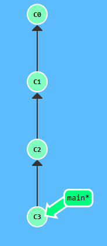

**Aprendizaje:**  
Cada vez que se ejecuta `git commit`, Git crea un nuevo commit a partir del
commit actual. Cuando `HEAD` está asociado a una rama, como `main`, la rama
avanza automáticamente para apuntar al nuevo commit. Esto permite construir un
historial lineal de cambios.

---

#### Nivel 2 - Creando ramas en Git

**Objetivo:**  
Crear una nueva rama llamada `bugFix` y cambiar el contexto de trabajo hacia
esa rama.

**Estado inicial:**  
El repositorio contiene los commits `C0` y `C1`. La rama `main` se encuentra
apuntando a `C1` y es la rama activa.

| Paso | Comando | Efecto sobre el repositorio |
| ---: | --- | --- |
| 1 | `git branch bugFix` | Crea la rama `bugFix` apuntando al mismo commit que `main`, sin cambiar la rama activa. |
| 2 | `git checkout bugFix` | Cambia la rama activa de `main` a `bugFix`. |

**Estado final:**  
Las ramas `main` y `bugFix` apuntan ambas al commit `C1`, pero `bugFix` es la
rama activa.

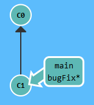

**Aprendizaje:**  
Crear una rama no implica cambiarse automáticamente a ella. El comando
`git branch` crea la referencia, mientras que `git checkout` permite cambiar
la rama activa. Una rama nueva comienza apuntando al mismo commit desde el
cual fue creada.

---

#### Nivel 3 - Haciendo merge en Git

**Objetivo:**  

Crear una rama `bugFix`, realizar un commit en ella, regresar a `main`,
crear otro commit y finalmente integrar los cambios de `bugFix` en `main`
mediante un merge.

**Estado inicial:**  

El repositorio contiene los commits `C0` y `C1`. La rama `main` se encuentra
apuntando a `C1` y es la rama activa.

| Paso | Comando | Efecto sobre el repositorio |
| ---: | --- | --- |
| 1 | `git checkout -b bugFix` | Crea la nueva rama `bugFix` a partir de `main` y cambia inmediatamente a ella. Ambas ramas parten inicialmente de `C1`. |
| 2 | `git commit` | Crea el commit `C2` como hijo de `C1`. La rama `bugFix` avanza hasta `C2`. |
| 3 | `git checkout main` | Cambia nuevamente a la rama `main`, que continúa apuntando a `C1`. |
| 4 | `git commit` | Crea el commit `C3` como hijo de `C1`. La rama `main` avanza hasta `C3`, generando una línea de desarrollo distinta a la de `bugFix`. |
| 5 | `git merge bugFix` | Integra en `main` los cambios de `bugFix`. Como ambas ramas contienen commits distintos posteriores a `C1`, Git crea el merge commit `C4`, cuyos padres son `C3` y `C2`. |

**Estado final:**  

La rama `bugFix` permanece apuntando a `C2`, mientras que `main` queda activa
y apunta al merge commit `C4`.

La estructura final puede representarse como:

`bugFix → C2`  
`main → C4`

El commit `C4` combina las dos líneas de desarrollo que parten de `C1`.

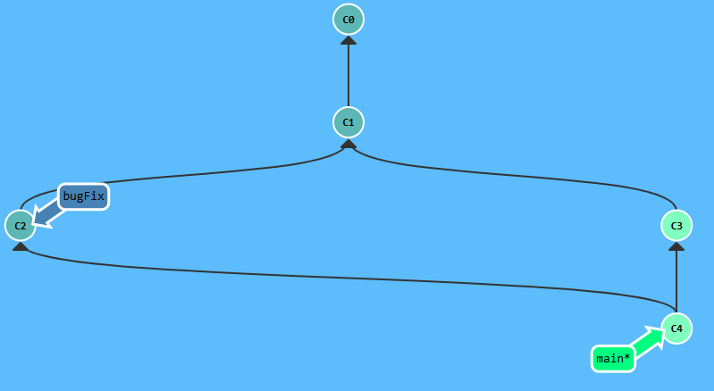

**Aprendizaje:**  

`git merge` permite integrar historiales que han avanzado de forma
independiente. Cuando las dos ramas contienen cambios distintos desde un
ancestro común, Git crea un commit de merge con dos padres, preservando ambas
líneas de desarrollo en el historial.

También se aprendió que `git checkout -b bugFix` permite crear una rama y
cambiarse a ella en un solo comando, siendo equivalente a ejecutar primero
`git branch bugFix` y después `git checkout bugFix`. Esto permitió completar
el nivel con menos comandos sin cambiar el resultado final.

---

#### Nivel 4 - Introducción a rebase

**Objetivo:**  
Crear una rama `bugFix`, generar cambios independientes en `bugFix` y `main`,
y posteriormente reorganizar el historial de `bugFix` mediante `git rebase`
para colocar sus cambios encima del último commit de `main`.

**Estado inicial:**  
El repositorio contiene los commits `C0` y `C1`. La rama `main` se encuentra
apuntando a `C1` y es la rama activa.

| Paso | Comando | Efecto sobre el repositorio |
| ---: | --- | --- |
| 1 | `git checkout -b bugFix` | Crea la rama `bugFix` a partir de `main` y cambia inmediatamente a ella. |
| 2 | `git commit` | Crea el commit `C2` como hijo de `C1`. La rama `bugFix` avanza a `C2`. |
| 3 | `git checkout main` | Cambia nuevamente a la rama `main`, que continúa apuntando a `C1`. |
| 4 | `git commit` | Crea el commit `C3` como hijo de `C1`. La rama `main` avanza a `C3`. |
| 5 | `git checkout bugFix` | Cambia nuevamente a la rama `bugFix`, ubicada inicialmente en `C2`. |
| 6 | `git rebase main` | Reaplica el cambio de `C2` encima de `C3`, generando el nuevo commit `C2'`. |

**Estado final:**  
La rama `main` apunta a `C3`, mientras que `bugFix` apunta a `C2'`. El historial
activo queda lineal:

`C0 → C1 → C3 → C2'`

El commit original `C2` deja de formar parte del historial actual de
`bugFix`, ya que fue reemplazado por `C2'` durante el rebase.

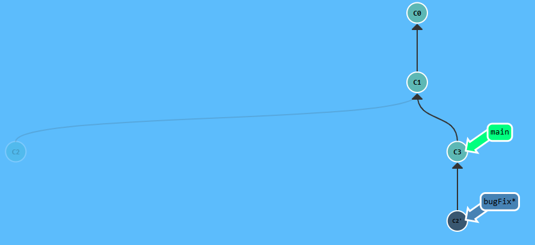

**Aprendizaje:**  
`git rebase` permite reorganizar el historial colocando los commits de una
rama encima de otra. A diferencia de `git merge`, no crea un commit adicional
de unión. En cambio, vuelve a aplicar los cambios y genera nuevos commits con
un padre diferente, por lo que sus identificadores también cambian.

---

### Acelerando

#### Nivel 5 - Desacopla tu HEAD

**Objetivo:**  

Desacoplar `HEAD` de la rama `bugFix` y hacer que apunte directamente al
commit `C4`, especificando dicho commit mediante su hash.

**Estado inicial:**  

El repositorio contiene los commits `C0`, `C1`, `C2`, `C3` y `C4`. La rama
`main` se encuentra apuntando a `C2`, mientras que la rama `bugFix` apunta a
`C4` y es la rama activa.

| Paso | Comando | Efecto sobre el repositorio |
| ---: | --- | --- |
| 1 | `git checkout C4` | Desacopla `HEAD` de la rama `bugFix` y hace que apunte directamente al commit `C4`. La rama `bugFix` permanece apuntando a `C4`. |

**Estado final:**  

`HEAD` queda apuntando directamente al commit `C4`, mientras que la rama
`bugFix` también permanece apuntando a `C4`. La rama `main` continúa
apuntando a `C2`.

El cambio principal puede representarse de la siguiente manera:

`bugFix → C4 ← HEAD`

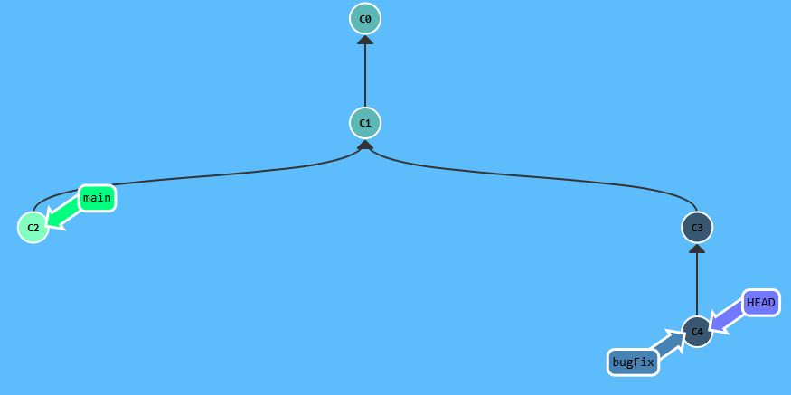

**Aprendizaje:**  

Normalmente `HEAD` se encuentra asociado a una rama, y esa rama apunta a un
commit. Al ejecutar `git checkout` utilizando directamente el hash de un
commit, `HEAD` deja de estar asociado a una rama y pasa a apuntar directamente
al commit seleccionado. Este estado se conoce como *detached HEAD* y permite
examinar o trabajar temporalmente desde un punto específico del historial sin
mover las ramas existentes.

---

#### Nivel 6 - Referencias relativas (^)

**Objetivo:**  

Mover `HEAD` al commit padre del commit actual utilizando una referencia
relativa, en lugar de especificar directamente el hash del commit.

**Estado inicial:**  

El repositorio contiene los commits `C0`, `C1`, `C2`, `C3` y `C4`. La rama
`main` se encuentra apuntando a `C2`, mientras que la rama `bugFix` apunta a
`C4` y es la rama activa. Por lo tanto, `HEAD` se encuentra asociado a
`bugFix` en el commit `C4`.

| Paso | Comando | Efecto sobre el repositorio |
| ---: | --- | --- |
| 1 | `git checkout HEAD^` | Utiliza la referencia relativa `^` para seleccionar el padre del commit actual. Como `HEAD` se encontraba en `C4`, se mueve a su padre `C3`. Al hacer checkout directamente a ese commit, `HEAD` queda desacoplado de la rama `bugFix`. |

**Estado final:**  

`HEAD` queda apuntando directamente al commit `C3` en estado *detached HEAD*.
La rama `bugFix` permanece apuntando a `C4`, mientras que `main` continúa
apuntando a `C2`.

La referencia utilizada puede interpretarse como:

`HEAD^ = padre de C4 = C3`

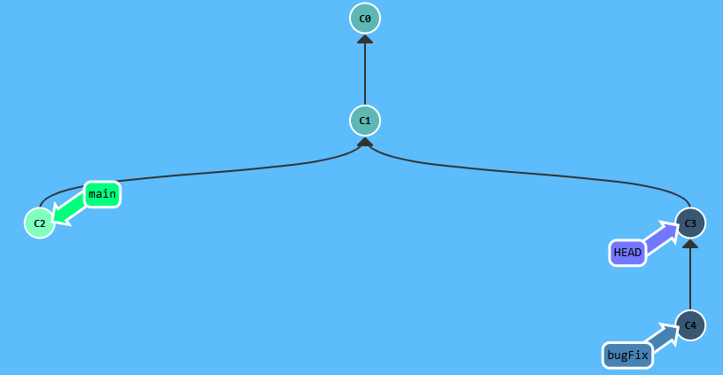

**Aprendizaje:**  

Las referencias relativas permiten navegar por el historial sin necesidad de
conocer el hash exacto de cada commit. El símbolo `^` indica el commit padre
de la referencia especificada. En este caso, `HEAD^` permitió desplazarse una
generación hacia atrás desde `C4` hasta `C3`. Al realizar checkout directamente
sobre ese commit, `HEAD` quedó desacoplado sin modificar la posición de las
ramas existentes.

---

#### Nivel 7 - Referencias relativas #2 (~)

**Objetivo:**  

Mover `HEAD`, `main` y `bugFix` a las posiciones indicadas utilizando
referencias relativas y el movimiento forzado de ramas. El objetivo final es
que `bugFix` apunte a `C0`, `HEAD` quede desacoplado en `C1` y `main` apunte
a `C6`.

**Estado inicial:**  

El repositorio contiene los commits `C0`, `C1`, `C2`, `C3`, `C4`, `C5` y
`C6`. `HEAD` se encuentra desacoplado y apunta directamente a `C2`. La rama
`main` apunta a `C4`, mientras que la rama `bugFix` apunta a `C5`.

| Paso | Comando | Efecto sobre el repositorio |
| ---: | --- | --- |
| 1 | `git branch -f bugFix HEAD~2` | Mueve forzadamente la rama `bugFix` al commit ubicado dos generaciones antes de `HEAD`. Como `HEAD` apunta a `C2`, `HEAD~2` corresponde a `C0`, por lo que `bugFix` pasa de `C5` a `C0`. |
| 2 | `git checkout HEAD~1` | Mueve `HEAD` una generación hacia atrás, desde `C2` hasta su padre `C1`. Como se realiza checkout directamente sobre el commit, `HEAD` permanece desacoplado. |
| 3 | `git branch -f main C6` | Mueve forzadamente la rama `main` desde `C4` hasta el commit `C6`, sin cambiar la posición actual de `HEAD`. |

**Estado final:**  

La rama `bugFix` queda apuntando al commit `C0`, `HEAD` queda desacoplado y
apuntando directamente a `C1`, y la rama `main` queda apuntando al commit
`C6`.

Las posiciones finales pueden resumirse de la siguiente manera:

`bugFix → C0`  
`HEAD → C1`  
`main → C6`

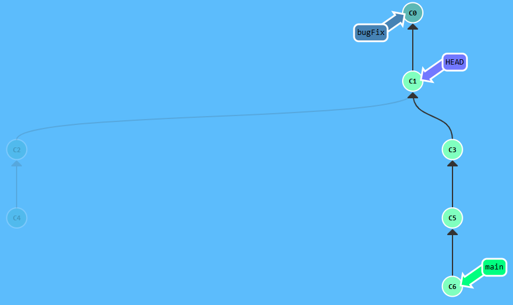

**Aprendizaje:**  

El operador `~` permite desplazarse varias generaciones hacia atrás en el
historial de commits. Por ejemplo, `HEAD~2` representa el segundo ancestro del
commit al que apunta `HEAD`. Además, `git branch -f` permite cambiar
directamente el commit al que apunta una rama sin necesidad de realizar
checkout sobre ella. Este ejercicio demuestra que las ramas funcionan como
referencias móviles y que es posible modificar su posición de manera
independiente a la posición de `HEAD`.

---

#### Nivel 8 - Revirtiendo cambios en Git

**Objetivo:**  

Revertir el commit más reciente tanto en una rama local como en una rama que
representa cambios ya publicados, utilizando el método apropiado en cada caso.

**Estado inicial:**  

El repositorio contiene los commits `C0`, `C1`, `C2` y `C3`. La rama `main`
apunta a `C1`. La rama `pushed` apunta a `C2`, mientras que la rama `local`
apunta a `C3` y es la rama activa.

| Paso | Comando | Efecto sobre el repositorio |
| ---: | --- | --- |
| 1 | `git reset HEAD^` | Mueve la rama `local` desde `C3` hasta su commit padre `C1`. Como el cambio de `C3` es local y no se considera compartido, se puede reescribir el historial de la rama eliminando ese commit de su línea activa. |
| 2 | `git checkout pushed` | Cambia la rama activa de `local` a `pushed`, que se encuentra apuntando al commit `C2`. |
| 3 | `git revert HEAD` | Crea un nuevo commit `C2'` que revierte los cambios introducidos por `C2`. La rama `pushed` avanza a `C2'` sin eliminar `C2` del historial. |

**Estado final:**  

Las ramas `main` y `local` quedan apuntando al commit `C1`. La rama `pushed`
queda activa y apunta al nuevo commit `C2'`, creado para revertir los cambios
del commit `C2`.

Las posiciones finales pueden resumirse de la siguiente manera:

`main → C1`  
`local → C1`  
`pushed → C2'`

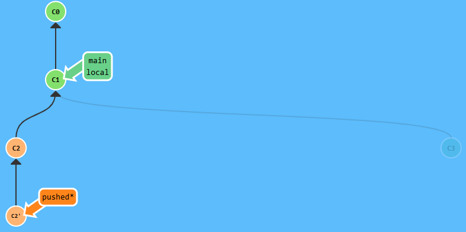

**Aprendizaje:**  

`git reset` y `git revert` permiten deshacer cambios, pero modifican el
historial de forma diferente. `git reset` mueve la referencia de una rama a
un commit anterior, por lo que es apropiado para cambios locales que todavía
no han sido compartidos. En cambio, `git revert` conserva el historial
existente y crea un nuevo commit que deshace los cambios de otro commit, por
lo que resulta más seguro cuando el historial ya ha sido publicado o
compartido con otras personas.

---

### Moviendo el trabajo por ahí

#### Nivel 9 - Introducción a cherry-pick

**Objetivo:**  

Copiar hacia la rama `main` tres commits específicos provenientes de otras
ramas, sin integrar por completo los historiales de dichas ramas. Los commits
seleccionados son `C3`, `C4` y `C7`.

**Estado inicial:**  

El repositorio contiene varias ramas que parten del commit `C1`. La rama
`bugFix` contiene los commits `C2` y `C3`, la rama `side` contiene los commits
`C4` y `C5`, y la rama `another` contiene los commits `C6` y `C7`. La rama
`main` se encuentra apuntando a `C1` y es la rama activa.

| Paso | Comando | Efecto sobre el repositorio |
| ---: | --- | --- |
| 1 | `git cherry-pick C3 C4 C7` | Toma los cambios introducidos por los commits `C3`, `C4` y `C7`, en ese orden, y los reaplica sobre la rama activa `main`. Como los commits se aplican sobre una ubicación diferente del historial, Git genera nuevas copias identificadas en el simulador como `C3'`, `C4'` y `C7'`. Las ramas originales no cambian de posición. |

**Estado final:**  

La rama `main` queda apuntando a `C7'` después de incorporar de forma
secuencial copias de los cambios correspondientes a `C3`, `C4` y `C7`.

El nuevo historial de `main` puede representarse como:

`C0 → C1 → C3' → C4' → C7'`

Las ramas `bugFix`, `side` y `another` permanecen en sus posiciones
originales, ya que `cherry-pick` copia commits específicos en lugar de
fusionar las ramas completas.

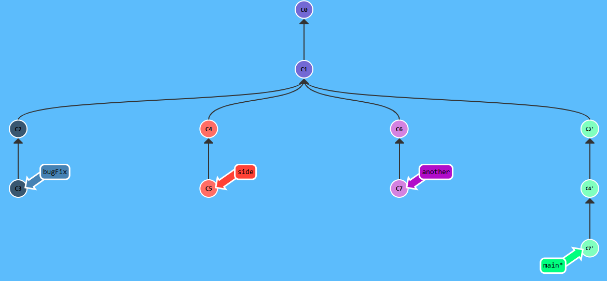

**Aprendizaje:**  

`git cherry-pick` permite seleccionar uno o varios commits concretos de otra
parte del historial y aplicar sus cambios sobre la rama actual. A diferencia
de `merge`, no incorpora necesariamente toda una rama ni crea una unión entre
dos historiales. Los commits seleccionados se vuelven a crear sobre la rama
destino, por lo que conservan sus cambios pero adquieren nuevos
identificadores. Además, cuando se especifican varios commits en un mismo
comando, Git los aplica en el orden indicado.

---

#### Nivel 10 - Introducción al rebase interactivo

**Objetivo:**  

Utilizar un rebase interactivo para reorganizar los commits recientes de la
rama `main`, eliminando un commit y modificando el orden de los restantes hasta
alcanzar el historial indicado en la visualización objetivo.

**Estado inicial:**  

La rama `main` contiene cuatro commits consecutivos posteriores a `C1`:
`C2`, `C3`, `C4` y `C5`. `main` es la rama activa y `HEAD` se encuentra
asociado a ella en el commit `C5`. La referencia `overHere` permanece
apuntando a `C1`.

| Paso | Comando | Efecto sobre el repositorio |
| ---: | --- | --- |
| 1 | `git rebase -i HEAD~4` | Inicia un rebase interactivo tomando como base el commit ubicado cuatro generaciones antes de `HEAD`, que corresponde a `C1`. Esto permite modificar los cuatro commits posteriores (`C2`, `C3`, `C4` y `C5`), cambiando su orden o eliminándolos. Durante el proceso se elimina `C2` y se reorganizan los demás para obtener el orden `C3`, `C5`, `C4`. Git vuelve a crear estos commits como `C3'`, `C5'` y `C4'`. |

**Estado final:**  

La rama `main` queda apuntando al nuevo commit `C4'`, luego de reorganizar el
historial. La nueva secuencia activa es:

`C0 → C1 → C3' → C5' → C4'`

Los commits originales `C2`, `C3`, `C4` y `C5` dejan de formar parte del
historial actual de `main`, ya que el rebase interactivo reescribió esa parte
del historial.

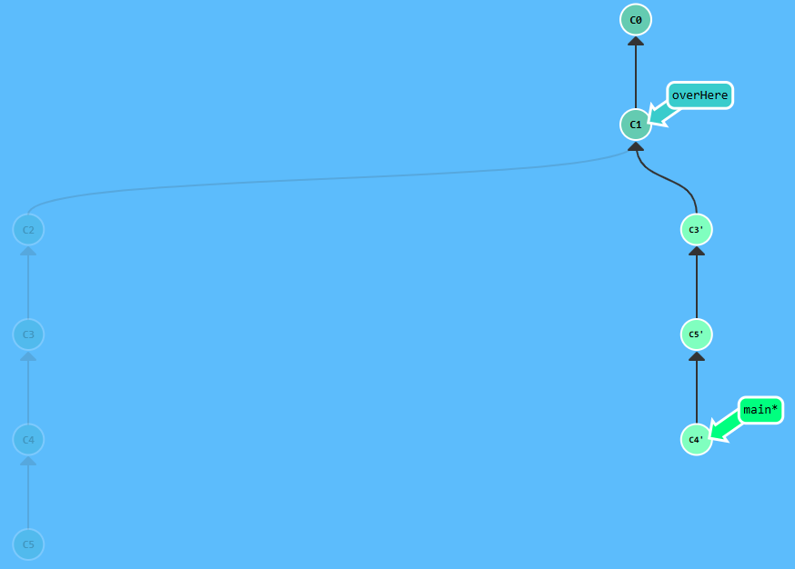

**Aprendizaje:**  

`git rebase -i` permite modificar de forma interactiva una parte reciente del
historial, incluyendo el orden de los commits y cuáles de ellos deben
conservarse. La expresión `HEAD~4` no se refiere al commit `C4`, sino al commit
ubicado cuatro generaciones antes de la posición actual de `HEAD`. Ese commit
funciona como base del rebase, y los commits posteriores son los que pueden
reorganizarse. Como el rebase vuelve a crear los commits seleccionados, sus
identificadores cambian.

---

#### Nivel 11 - Área de Staging (preparando)

**Objetivo:**  

Preparar y confirmar los cambios de dos archivos de manera independiente,
utilizando el área de staging para mantener cada commit enfocado en un único
cambio. Primero se debe agregar y confirmar `app.js`, y posteriormente hacer
lo mismo con `styles.css`.

**Estado inicial:**  

La rama `main` se encuentra activa y apunta al commit `C1`. El directorio de
trabajo contiene cambios pendientes en los archivos `app.js` y `styles.css`,
los cuales todavía no han sido incluidos en nuevos commits.

| Paso | Comando | Efecto sobre el repositorio |
| ---: | --- | --- |
| 1 | `git add app.js` | Agrega únicamente los cambios de `app.js` al área de staging, dejándolos preparados para formar parte del próximo commit. Los cambios de `styles.css` permanecen fuera del staging. |
| 2 | `git commit` | Crea el commit `C2` utilizando únicamente el contenido previamente preparado en el staging area, por lo que este commit contiene los cambios de `app.js`. La rama `main` avanza a `C2`. |
| 3 | `git add styles.css` | Agrega los cambios pendientes de `styles.css` al área de staging para incluirlos en el siguiente commit. |
| 4 | `git commit` | Crea el commit `C3` con los cambios preparados de `styles.css`. La rama `main` avanza desde `C2` hasta `C3`. |

**Estado final:**  

La rama `main` queda apuntando al commit `C3`. Los cambios de los dos archivos
se encuentran registrados en commits independientes:

`C0 → C1 → C2 (app.js) → C3 (styles.css)`

De esta manera, cada commit representa un cambio específico y mantiene el
historial organizado.

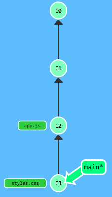

**Aprendizaje:**  

El área de staging funciona como una zona intermedia entre el directorio de
trabajo y el historial de commits. `git add` permite seleccionar exactamente
qué cambios formarán parte del próximo commit, mientras que `git commit`
registra únicamente lo que se encuentra preparado en dicha área. Esto permite
separar cambios relacionados con distintos archivos o tareas en commits
pequeños, coherentes y fáciles de revisar, en lugar de agrupar todos los
cambios pendientes en un solo commit.

---

#### Nivel 12 - Undoing with git restore

> **Nota de la plataforma:** Este nivel apareció sin traducir al español en la interfaz utilizada.

**Objetivo:**  

Preparar el repositorio para crear un commit que contenga únicamente los
cambios de `app.js`. Para ello, se debe retirar `secret.env` del área de
staging sin perder sus modificaciones, descartar los cambios no preparados
de `experiment.js` y finalmente crear el commit con el archivo que permanece
en staging.

**Estado inicial:**  

La rama `main` se encuentra activa. El área de staging contiene cambios de
`app.js` y `secret.env`, mientras que `experiment.js` presenta modificaciones
en el directorio de trabajo que todavía no han sido preparadas.

El objetivo es conservar los cambios de `secret.env` sin incluirlos en el
próximo commit, descartar los cambios de `experiment.js` y registrar únicamente
`app.js`.

| Paso | Comando | Efecto sobre el repositorio |
| ---: | --- | --- |
| 1 | `git restore --staged secret.env` | Retira `secret.env` del área de staging, pero conserva sus modificaciones en el directorio de trabajo. De esta manera, el archivo deja de formar parte del próximo commit sin perder sus cambios. |
| 2 | `git restore experiment.js` | Descarta las modificaciones no preparadas de `experiment.js` y restaura el archivo a la versión almacenada en `HEAD`. |
| 3 | `git commit` | Crea un nuevo commit utilizando únicamente los cambios que continúan en el área de staging. Como `app.js` es el único archivo preparado en ese momento, el nuevo commit contiene exclusivamente sus cambios. |

**Estado final:**  

La rama `main` avanza al nuevo commit `C2`, que contiene únicamente los cambios
de `app.js`.

El área de staging queda limpia. `experiment.js` vuelve a su versión almacenada
en `HEAD`, mientras que los cambios de `secret.env` permanecen sin preparar en
el directorio de trabajo.

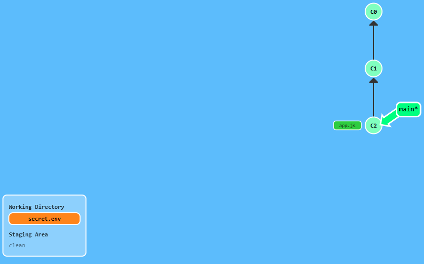

**Aprendizaje:**  

`git restore` puede utilizarse de distintas maneras según dónde se encuentren
los cambios. Con la opción `--staged`, permite retirar un archivo del área de
staging sin eliminar sus modificaciones del directorio de trabajo. En cambio,
cuando se utiliza sin `--staged` sobre un archivo modificado que no está
preparado, permite descartar esos cambios y restaurar la versión almacenada en
`HEAD`.

Este ejercicio también demuestra que `git commit` registra únicamente los
cambios presentes en el área de staging. Por esta razón, no fue necesario
ejecutar `git add`: `app.js` ya se encontraba preparado desde el estado inicial
y era el único archivo que se deseaba incluir en el commit.

---

### Un poco de todo

#### Nivel 13 - Tomando un único commit

**Objetivo:**  

Hacer que la rama `main` reciba únicamente el commit al que apunta
`bugFix`, sin incorporar necesariamente todos los commits intermedios de
la rama.

**Estado inicial:**  

El historial parte de `C1` y contiene una serie de commits en la rama
`bugFix`: `C2`, `C3` y `C4`. Las referencias `debug` y `printf` apuntan a
`C2` y `C3`, respectivamente, mientras que `bugFix` apunta a `C4`.

La rama `main` apunta a `C1`. Inicialmente, `bugFix` es la rama activa y
`HEAD` se encuentra asociado a ella en `C4`.

| Paso | Comando | Efecto sobre el repositorio |
| ---: | --- | --- |
| 1 | `git checkout main` | Cambia la rama activa desde `bugFix` hacia `main`. `HEAD` pasa a estar asociado a `main`, mientras que las demás ramas permanecen en sus posiciones originales. |
| 2 | `git cherry-pick C4` | Toma únicamente los cambios introducidos por el commit `C4` y los reaplica sobre la rama `main`. Como el commit se crea sobre una base diferente, Git genera una nueva copia del commit, representada como `C4'`. |

**Estado final:**  

La rama `main` queda activa y apunta al nuevo commit `C4'`, que contiene los
cambios provenientes del commit `C4`.

Las ramas originales permanecen sin modificaciones:

`debug → C2`  
`printf → C3`  
`bugFix → C4`  
`main → C4'`

El nuevo historial de `main` puede representarse como:

`C0 → C1 → C4'`

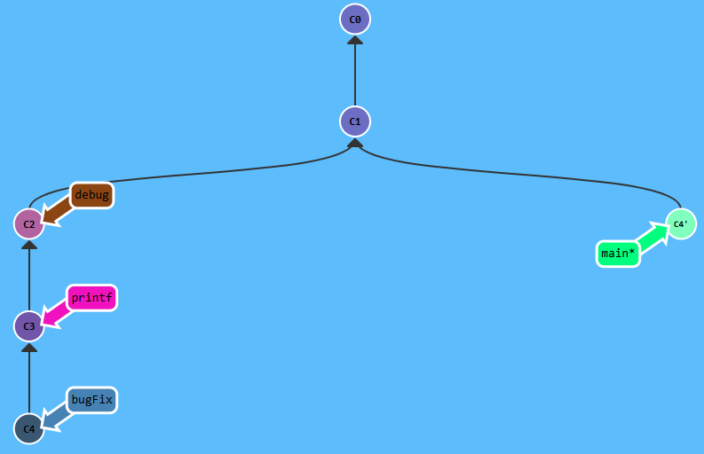

**Aprendizaje:**  

`git cherry-pick` permite trasladar un commit específico a otra rama sin
tener que incorporar toda la secuencia de commits que lo precede en la rama
original. En este caso, aunque `C4` se encontraba después de `C2` y `C3` en
`bugFix`, fue posible aplicar únicamente los cambios correspondientes a `C4`
sobre `main`.

El commit resultante aparece como `C4'` porque Git vuelve a crear el cambio
sobre una base distinta. Por lo tanto, aunque contiene los cambios de `C4`,
es un commit nuevo con una identidad diferente.

---

#### Nivel 14 - Haciendo malabares con los commits

**Objetivo:**  

Modificar uno de los commits recientes sin alterar permanentemente el orden
original del historial. Para ello, se debe utilizar un rebase interactivo para
mover temporalmente el commit que se desea corregir hasta la posición de
`HEAD`, modificarlo mediante `git commit --amend`, volver a colocar los commits
en su orden original y finalmente mover `main` al historial actualizado.

**Estado inicial:**  

El historial contiene dos commits recientes, `C2` y `C3`, posteriores a `C1`.
La referencia `newImage` apunta al commit `C2`, mientras que la rama `caption`
se encuentra en la parte más reciente del historial y es la rama activa.

El objetivo consiste en modificar el commit `C2` y conservar posteriormente
el orden original de los commits.

| Paso | Comando | Efecto sobre el repositorio |
| ---: | --- | --- |
| 1 | `git rebase -i HEAD~2` | Inicia un rebase interactivo sobre los dos commits más recientes. Se modifica temporalmente su orden para colocar el commit que se desea corregir en la posición de `HEAD`. Al reescribir el historial, Git genera nuevas versiones de los commits. |
| 2 | `git commit --amend` | Modifica el commit ubicado actualmente en `HEAD`. Como un commit es inmutable, Git no cambia el commit original, sino que crea una nueva versión con un identificador diferente. |
| 3 | `git rebase -i HEAD~2` | Ejecuta un segundo rebase interactivo para restaurar el orden original de los dos commits. Al volver a reescribirlos, se generan nuevas versiones de ambos commits. |
| 4 | `git branch -f main C3''` | Mueve forzadamente la rama `main` al commit más reciente del historial corregido, representado por el simulador como `C3''`. |

**Estado final:**  

El historial conserva el orden deseado, pero contiene nuevas versiones de los
commits como resultado de los rebases y del `amend`.

La parte actualizada del historial queda representada como:

`C0 → C1 → C2''' → C3''`

La rama `main` queda apuntando a `C3''`, junto con la rama activa `caption`.
La referencia `newImage` permanece apuntando al commit original `C2`.

El commit corregido, `C2`, presenta un apóstrofe adicional porque además de ser
reescrito durante los rebases también fue modificado mediante
`git commit --amend`.

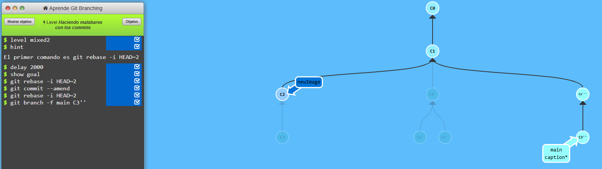

**Aprendizaje:**  

Un commit de Git no se modifica directamente. Operaciones como
`git commit --amend` y `git rebase` generan nuevos commits con nuevos
identificadores. En Learn Git Branching, los apóstrofes permiten visualizar
pedagógicamente estas nuevas versiones.

El rebase interactivo también puede utilizarse para mover temporalmente un
commit, modificarlo y después reorganizar nuevamente el historial. En este
ejercicio, `C2` fue reescrito durante el primer rebase, modificado mediante
`--amend` y reescrito nuevamente durante el segundo rebase, por lo que terminó
representado como `C2'''`. El commit `C3`, en cambio, únicamente fue reescrito
durante los dos rebases y terminó como `C3''`.

---

#### Nivel 15 - Haciendo malabares con los commits #2

**Objetivo:**  

Modificar el commit asociado a `newImage` y construir en `main` un historial
equivalente al objetivo, pero sin utilizar `git rebase -i`. Para lograrlo,
se deben copiar commits específicos mediante `cherry-pick`, modificar el commit
correspondiente con `git commit --amend` y conservar el orden final deseado.

**Estado inicial:**  

El historial parte del commit `C1`. La rama `newImage` apunta al commit `C2`,
mientras que la rama `caption` apunta al commit `C3` y es la rama activa.
La rama `main` permanece apuntando a `C1`.

El objetivo es que `main` termine conteniendo una versión modificada de `C2`
seguida por una copia de `C3`.

| Paso | Comando | Efecto sobre el repositorio |
| ---: | --- | --- |
| 1 | `git checkout main` | Cambia la rama activa desde `caption` hacia `main`. `HEAD` pasa a estar asociado a `main`, que se encuentra apuntando a `C1`. |
| 2 | `git cherry-pick C2` | Copia los cambios introducidos por `C2` sobre la rama `main`. Como se crea un nuevo commit sobre una base distinta, el simulador lo representa como `C2'`. |
| 3 | `git commit --amend` | Modifica el commit recién creado en `HEAD`. Git genera una nueva versión del commit, representada como `C2''`. |
| 4 | `git cherry-pick C3` | Copia los cambios introducidos por `C3` encima del commit modificado `C2''`. El nuevo commit se representa como `C3'`, y la rama `main` avanza hasta él. |

**Estado final:**  

La rama `main` queda activa y apunta al commit `C3'`. Su historial actualizado
queda representado como:

`C0 → C1 → C2'' → C3'`

Las referencias originales permanecen en sus posiciones:

`newImage → C2`  
`caption → C3`  
`main → C3'`

El commit `C2''` contiene la versión modificada del cambio original de `C2`,
mientras que `C3'` corresponde a una nueva aplicación de los cambios de `C3`.

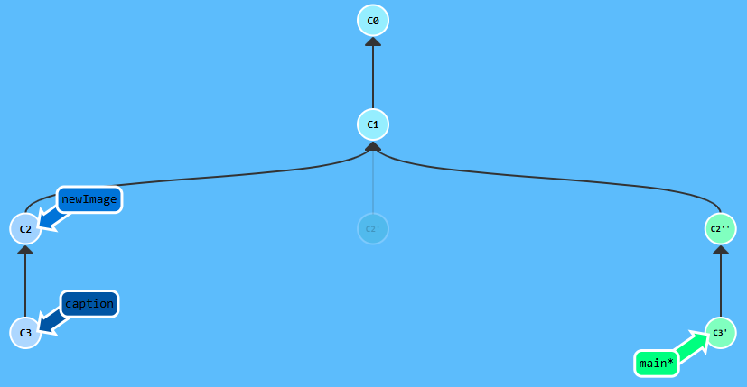

**Aprendizaje:**  

`git cherry-pick` puede utilizarse para construir de manera selectiva una
nueva secuencia de commits sin necesidad de reorganizar el historial existente
mediante un rebase interactivo. En este ejercicio se copió primero `C2`, se
modificó su nueva versión mediante `git commit --amend` y posteriormente se
copió `C3` encima de ella.

El resultado demuestra que diferentes combinaciones de comandos pueden alcanzar
una estructura de historial equivalente. También refuerza que tanto
`cherry-pick` como `--amend` generan nuevos commits con identificadores
distintos, lo que Learn Git Branching representa mediante apóstrofes.

---

#### Nivel 16 - Tags en Git

**Objetivo:**  

Crear dos etiquetas (`tags`) llamadas `v0` y `v1` sobre commits específicos
del historial y posteriormente realizar checkout sobre `v1` para observar el
comportamiento de `HEAD` al posicionarse directamente sobre un tag.

**Estado inicial:**  

El repositorio contiene varias ramas y commits. La rama `main` es la rama
activa y se encuentra apuntando al commit `C5`. La rama `side` apunta a `C3`.
Los commits `C1` y `C2` todavía no tienen los tags solicitados.

El objetivo es crear el tag `v0` sobre `C1`, el tag `v1` sobre `C2` y
finalmente posicionar `HEAD` sobre `v1`.

| Paso | Comando | Efecto sobre el repositorio |
| ---: | --- | --- |
| 1 | `git tag v0 C1` | Crea el tag `v0` y lo asocia al commit `C1`. La posición de las ramas y de `HEAD` no cambia. |
| 2 | `git tag v1 C2` | Crea el tag `v1` y lo asocia al commit `C2`. Al igual que el comando anterior, solamente se crea una referencia al commit y no se modifica el historial. |
| 3 | `git checkout v1` | Hace checkout al commit identificado por el tag `v1`, es decir, `C2`. Como un tag no es una rama móvil, `HEAD` queda apuntando directamente a `C2` en estado *detached HEAD*. |

**Estado final:**  

El tag `v0` queda asociado al commit `C1`, mientras que el tag `v1` queda
asociado al commit `C2`.

Después de ejecutar `git checkout v1`, `HEAD` apunta directamente a `C2` y
queda desacoplado. Las ramas existentes permanecen en sus posiciones
originales.

Las referencias relevantes pueden resumirse como:

`v0 → C1`  
`v1 → C2 ← HEAD`  
`side → C3`  
`main → C5`

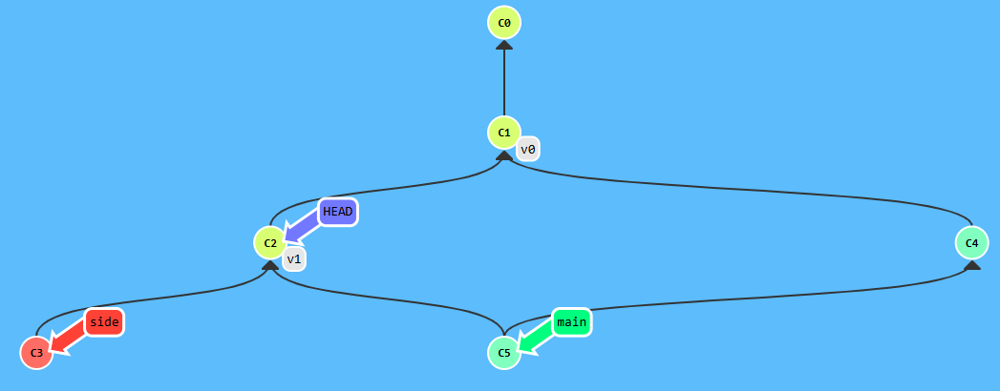

**Aprendizaje:**  

Un tag permite asignar un nombre permanente y fácilmente identificable a un
commit específico del historial. A diferencia de una rama, un tag no avanza
automáticamente cuando se crean nuevos commits, por lo que resulta útil para
marcar versiones o puntos importantes del proyecto.

Al hacer checkout directamente sobre un tag, `HEAD` queda desacoplado porque
el tag no funciona como una rama sobre la cual se pueda continuar avanzando
automáticamente. Para desarrollar nuevos cambios desde ese punto sería
necesario crear o cambiar a una rama.

---

#### Nivel 17 - Git Describe

**Objetivo:**  

Explorar el funcionamiento de `git describe` sobre distintas ramas del
repositorio para interpretar su posición con respecto a los tags existentes.
Después de revisar las descripciones solicitadas, crear un nuevo commit para
completar el nivel.

**Estado inicial:**  

El repositorio contiene los tags `v0` y `v1`. El tag `v0` apunta al commit
`C0`, mientras que `v1` apunta a `C3`.

La rama `main` apunta a `C2`, la rama `side` apunta a `C4` y la rama
`bugFix` apunta a `C6` y es la rama activa.

| Paso | Comando | Efecto sobre el repositorio |
| ---: | --- | --- |
| 1 | `git describe main` | Describe la posición de `main` con respecto al tag alcanzable más cercano. El resultado `v0-2-gC2` indica que `main` se encuentra dos commits después de `v0`, en el commit `C2`. El repositorio no se modifica. |
| 2 | `git describe side` | Produce `v1-1-gC4`, indicando que la rama `side` se encuentra un commit después del tag `v1`, en `C4`. No modifica el historial. |
| 3 | `git describe bugFix` | Produce `v1-2-gC6`, indicando que `bugFix` se encuentra dos commits después de `v1`, en `C6`. No modifica el historial. |
| 4 | `git describe` | Describe la posición actual de `HEAD`. Como la rama activa es `bugFix` y apunta a `C6`, devuelve igualmente `v1-2-gC6`. |
| 5 | `git commit` | Crea un nuevo commit `C7` como hijo de `C6`. La rama activa `bugFix` avanza hasta este nuevo commit. |

**Estado final:**  

La rama `bugFix` permanece activa y avanza desde `C6` hasta el nuevo commit
`C7`. Las demás ramas y los tags no cambian de posición.

Las referencias principales quedan de la siguiente manera:

`v0 → C0`  
`main → C2`  
`v1 → C3`  
`side → C4`  
`bugFix → C7`

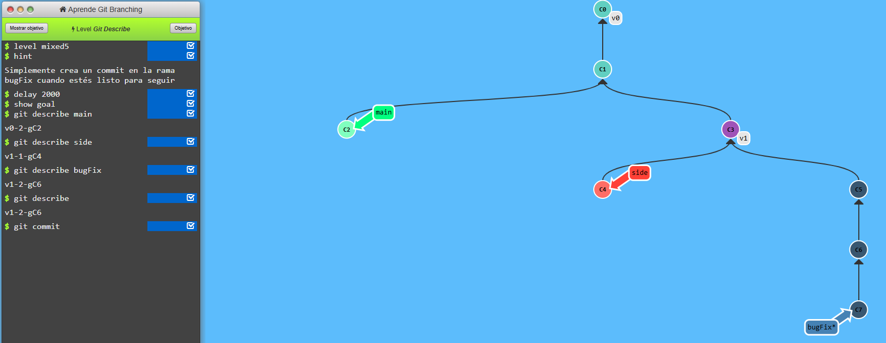

**Aprendizaje:**  

`git describe` permite identificar un commit utilizando como referencia el tag
alcanzable más cercano, la cantidad de commits que lo separan de dicho tag y
una representación del identificador del commit.

Por ejemplo, la salida:

`v1-2-gC6`

puede interpretarse como que el commit consultado se encuentra dos commits
después del tag `v1` y que el identificador mostrado por el simulador es `C6`.

El comando `git describe` es únicamente informativo y no modifica ramas,
commits ni tags. En este nivel, el único comando que alteró el repositorio fue
`git commit`, que creó `C7` y movió la rama `bugFix` hacia adelante.

---

### Temas avanzados

#### Nivel 18 - Rebaseando más de 9000 veces

**Objetivo:**  

Construir un historial lineal en la rama `main` utilizando únicamente
operaciones de `rebase`, integrando de forma ordenada los cambios provenientes
de las ramas `bugFix`, `side` y `another`.

El resultado esperado es que los commits de las distintas ramas queden
reaplicados secuencialmente sobre `main`, sin utilizar `cherry-pick`.

**Estado inicial:**  

El repositorio contiene varias líneas de desarrollo independientes. La rama
`main` es la rama activa y apunta al commit `C2`. La rama `bugFix` apunta a
`C3`, mientras que `side` y `another` parten de otra línea del historial y
apuntan a `C6` y `C7`, respectivamente.

La estructura relevante puede resumirse como:

`main → C2`  
`bugFix → C3`  
`side → C6`  
`another → C7`

El objetivo es reorganizar estos cambios para crear una única línea de
historial sobre `main`.

| Paso | Comando | Efecto sobre el repositorio |
| ---: | --- | --- |
| 1 | `git rebase main bugFix` | Reaplica sobre `main` los commits pertenecientes a `bugFix` que todavía no están contenidos en `main`. El commit `C3` se vuelve a crear encima de `C2`, generando `C3'`, y la rama `bugFix` avanza hasta esta nueva versión. |
| 2 | `git rebase bugFix side` | Reaplica la línea de desarrollo de `side` encima de la nueva posición de `bugFix`. Los commits `C4`, `C5` y `C6` se vuelven a crear como `C4'`, `C5'` y `C6'`, haciendo que `side` termine apuntando a `C6'`. |
| 3 | `git rebase --onto side C5 another` | Reaplica sobre `side` únicamente los commits de `another` que se encuentran después de `C5`. Como el único commit exclusivo posterior a `C5` es `C7`, se crea una nueva versión `C7'` encima de `C6'`, evitando volver a copiar `C4` y `C5`. |
| 4 | `git rebase another main` | Actualiza `main` utilizando `another` como nueva base. Como el historial de `another` ya contiene toda la secuencia reorganizada, `main` avanza hasta `C7'` y queda apuntando al mismo commit que `another`. |

**Estado final:**  

El historial queda completamente lineal y la rama `main` termina apuntando al
commit `C7'`, junto con la rama `another`.

La nueva secuencia es:

`C0 → C1 → C2 → C3' → C4' → C5' → C6' → C7'`

Las referencias finales quedan aproximadamente de la siguiente manera:

`bugFix → C3'`  
`side → C6'`  
`another → C7'`  
`main → C7'`

La rama `main` permanece activa.

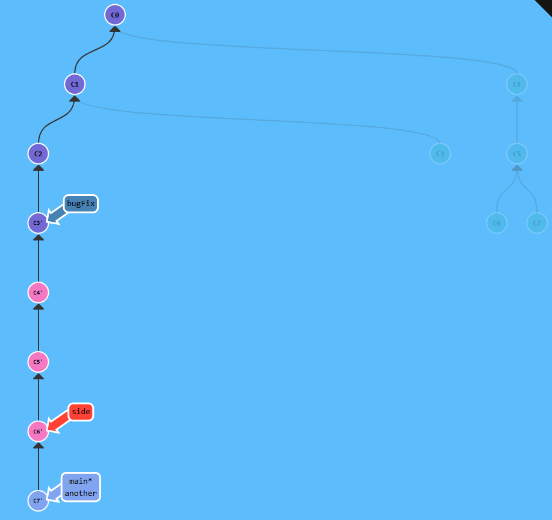

**Aprendizaje:**  

`git rebase` permite trasladar secuencias completas de commits y construir un
historial lineal a partir de ramas que originalmente se desarrollaron de forma
independiente. Al reaplicar los commits sobre una nueva base, Git crea nuevas
versiones de estos commits, lo que Learn Git Branching representa mediante
apóstrofes.

Este ejercicio también introduce el uso avanzado de `git rebase --onto`. La
forma `git rebase --onto A B C` puede interpretarse como: tomar de la rama `C`
los commits posteriores a `B` y volver a aplicarlos encima de `A`. En este
caso, `git rebase --onto side C5 another` permitió seleccionar únicamente
`C7` de la rama `another` y colocarlo después de `C6'`, sin volver a copiar
los commits `C4` y `C5`.

Finalmente, el ejercicio demuestra que es posible reorganizar varias ramas y
construir una única línea de historial únicamente mediante operaciones de
rebase, sin necesidad de utilizar `cherry-pick`.

---

#### Nivel 19 - Múltiples padres

**Objetivo:**  

Crear una nueva rama llamada `bugWork` apuntando al commit `C2`, utilizando
referencias relativas para navegar por un historial que contiene un commit con
múltiples padres. La rama `main` debe permanecer activa y en su posición
original.

**Estado inicial:**  

La rama `main` es la rama activa y apunta al commit `C7`. El historial contiene
un commit de merge `C6`, el cual posee dos padres: `C4` como primer padre y
`C5` como segundo padre.

El commit `C5`, a su vez, tiene como padre a `C2`. El objetivo es crear la rama
`bugWork` directamente sobre `C2` sin mover `HEAD` de la rama `main`.

| Paso | Comando | Efecto sobre el repositorio |
| ---: | --- | --- |
| 1 | `git branch bugWork HEAD~^2~` | Crea la rama `bugWork` en el commit obtenido al navegar desde `HEAD`: `HEAD~` lleva de `C7` a `C6`; `^2` selecciona el segundo padre de `C6`, que es `C5`; y el último `~` lleva al primer padre de `C5`, que es `C2`. La nueva rama queda apuntando a `C2` sin cambiar la posición de `HEAD` ni de `main`. |

**Estado final:**  

La nueva rama `bugWork` queda apuntando al commit `C2`, mientras que `main`
permanece activa y continúa apuntando a `C7`.

Las referencias finales pueden resumirse como:

`bugWork → C2`  
`main → C7`

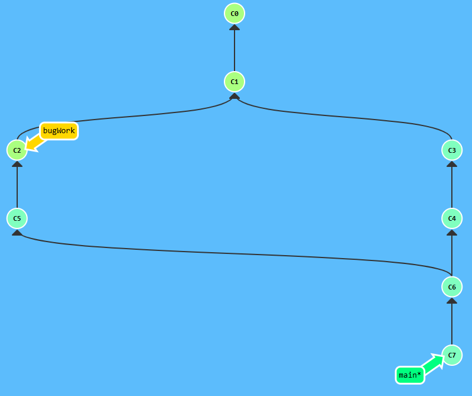

**Aprendizaje:**  

Las referencias relativas pueden combinar los operadores `~` y `^` para
navegar por historiales que contienen commits con múltiples padres. El operador
`~` sigue el primer padre, mientras que `^2` permite seleccionar explícitamente
el segundo padre de un commit de merge.

En este ejercicio, `HEAD~^2~` permitió llegar desde `C7` hasta `C2` siguiendo
una ruta específica por el historial. Además, `git branch` puede recibir una
referencia como segundo argumento, lo que permite crear una rama directamente
en un commit determinado sin necesidad de hacer checkout previamente.

Inicialmente, la solución se realizó en tres pasos haciendo checkout al commit,
creando la rama y regresando posteriormente a `main`. Sin embargo, utilizar
`git branch bugWork HEAD~^2~` permite obtener exactamente el mismo resultado
en un solo comando y sin modificar temporalmente la posición de `HEAD`.

---

#### Nivel 20 - Ensalada de ramas

**Objetivo:**  

Actualizar las ramas `one`, `two` y `three` utilizando versiones reorganizadas
de los commits recientes de `main`. Cada rama requiere una estructura diferente:
`one` debe excluir `C5` y reordenar los commits restantes, `two` debe conservar
todos los commits pero en un orden diferente, y `three` únicamente debe apuntar
al commit `C2`.

**Estado inicial:**  

La rama `main` es la rama activa y contiene una secuencia lineal de commits:

`C0 → C1 → C2 → C3 → C4 → C5`

La rama `main` apunta a `C5`, mientras que las ramas `one`, `two` y `three`
apuntan inicialmente al commit `C1`.

Las posiciones iniciales pueden resumirse como:

`one → C1`  
`two → C1`  
`three → C1`  
`main → C5`

| Paso | Comando | Efecto sobre el repositorio |
| ---: | --- | --- |
| 1 | `git checkout one` | Cambia la rama activa desde `main` hacia `one`, que se encuentra apuntando a `C1`. |
| 2 | `git cherry-pick C4 C3 C2` | Reaplica sobre `one` los cambios de `C4`, `C3` y `C2`, en ese orden. Esto genera las nuevas versiones `C4'`, `C3'` y `C2'`. El commit `C5` no se incluye, tal como requiere el objetivo. |
| 3 | `git checkout two` | Cambia la rama activa desde `one` hacia `two`, que todavía se encuentra apuntando a `C1`. |
| 4 | `git cherry-pick C5 C4 C3 C2` | Reaplica sobre `two` los commits `C5`, `C4`, `C3` y `C2` en el orden indicado. Se generan `C5'`, `C4''`, `C3''` y `C2''`. La rama `two` avanza hasta `C2''`. |
| 5 | `git branch -f three C2` | Mueve forzadamente la rama `three` desde `C1` hasta el commit original `C2`, sin cambiar la rama activa ni crear un nuevo commit. |

**Estado final:**  

La rama `main` permanece sin modificaciones y continúa apuntando a `C5`.

La rama `one` contiene los cambios reorganizados de `C4`, `C3` y `C2`,
excluyendo `C5`:

`C1 → C4' → C3' → C2'`

La rama `two` contiene los cuatro commits reorganizados:

`C1 → C5' → C4'' → C3'' → C2''`

La rama `three` apunta directamente al commit original `C2`.

Las posiciones finales pueden resumirse como:

`main → C5`  
`three → C2`  
`one → C2'`  
`two → C2''`

La rama `two` queda activa al finalizar el nivel.

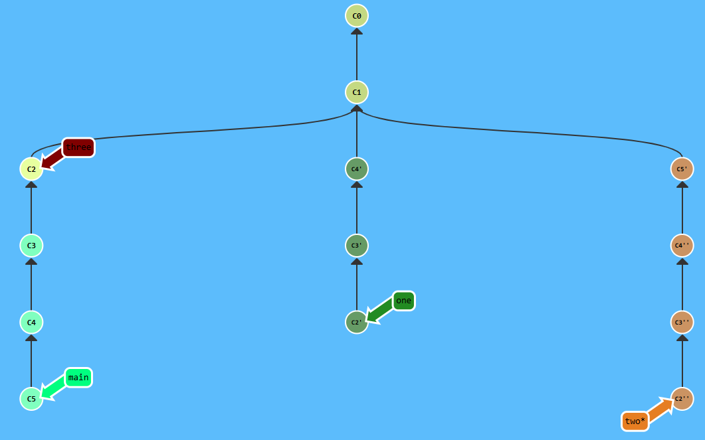

**Aprendizaje:**  

`git cherry-pick` permite construir historiales personalizados seleccionando
commits específicos y definiendo explícitamente el orden en que sus cambios
deben reaplicarse. Esto permite tanto excluir commits como reorganizarlos sin
modificar la rama original.

En la rama `one` se excluyó `C5` y se aplicaron únicamente `C4`, `C3` y `C2`.
En la rama `two` se conservaron los cuatro commits, pero se aplicaron en el
orden `C5`, `C4`, `C3`, `C2`. Como `C4`, `C3` y `C2` ya habían sido copiados
previamente para construir `one`, Learn Git Branching representa las nuevas
copias creadas para `two` con un segundo apóstrofe.

El ejercicio también demuestra que no siempre es necesario copiar commits.
Cuando únicamente se desea cambiar la posición de una rama, como ocurrió con
`three`, `git branch -f` permite mover directamente la referencia al commit
deseado sin modificar el historial.

---

### Progreso completo de Principal

La siguiente captura muestra todos los niveles disponibles de la sección
`Principal` completados en la versión utilizada de Learn Git Branching.

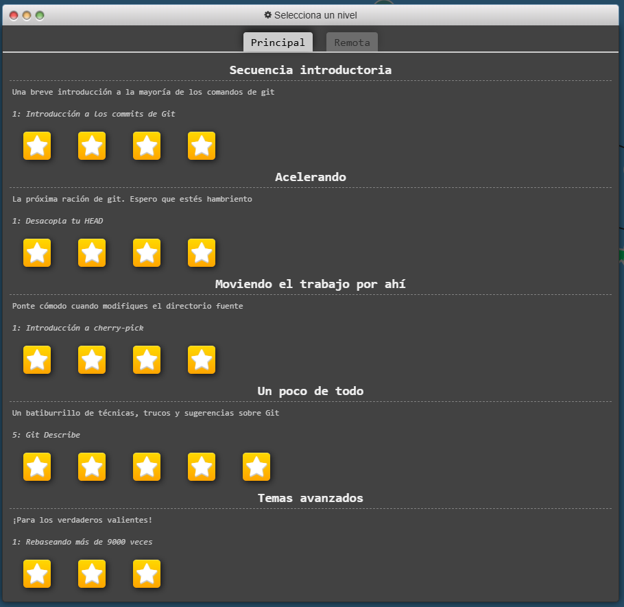

---

## Remota

### Push y Pull -- Git Remotes!

#### Nivel 1 - Introducción a clone

**Objetivo:**  

Clonar un repositorio remoto para crear una copia local del proyecto y
observar las referencias que Git utiliza para representar tanto la rama local
como el estado conocido de la rama remota.

**Estado inicial:**  

Existe un repositorio remoto con los commits `C0` y `C1`. La rama `main` del
repositorio remoto apunta al commit `C1`.

Todavía no existe una copia local del repositorio.

| Paso | Comando | Efecto sobre el repositorio |
| ---: | --- | --- |
| 1 | `git clone` | Crea una copia local del repositorio remoto. En la copia local se crea la rama `main`, que queda activa y apunta a `C1`. También se crea la referencia remota `o/main`, que representa el estado conocido de la rama `main` del remoto y apunta igualmente a `C1`. |

**Estado final:**  

El repositorio local contiene los mismos commits `C0` y `C1` que el
repositorio remoto.

En el repositorio local:

`main → C1`  
`o/main → C1`

La rama `main` es la rama local activa, mientras que `o/main` representa la
referencia de seguimiento remoto `origin/main` dentro del simulador.

En el repositorio remoto:

`main → C1`

Por lo tanto, inmediatamente después de realizar el clone, el repositorio
local y el remoto se encuentran sincronizados.

**Aprendizaje:**  

`git clone` crea una copia local de un repositorio remoto e inicializa las
referencias necesarias para trabajar con él. La rama `main` es una rama local
sobre la cual se puede trabajar normalmente, mientras que `o/main` representa
el último estado conocido de la rama `main` del repositorio remoto.

Learn Git Branching utiliza la abreviatura `o/` para representar `origin/`,
por lo que `o/main` corresponde conceptualmente a `origin/main` en un
repositorio Git real. Después de clonar el repositorio, ambas referencias
apuntan inicialmente al mismo commit porque todavía no existen cambios
divergentes entre el repositorio local y el remoto.

---

#### Nivel 2 - Ramas remotas

**Objetivo:**  

Observar la diferencia entre una rama local y una referencia de seguimiento
remoto realizando un commit sobre `main` y posteriormente haciendo checkout
sobre `o/main` para crear otro commit desde esa posición.

**Estado inicial:**  

El repositorio local contiene la rama `main` y la referencia remota `o/main`,
ambas relacionadas con el historial compartido hasta `C1`.

La rama `main` del repositorio remoto se encuentra en `C2`, mientras que
`o/main` representa localmente el último estado conocido del remoto y permanece
apuntando a `C1`.

| Paso | Comando | Efecto sobre el repositorio |
| ---: | --- | --- |
| 1 | `git commit` | Crea el commit local `C3` sobre la rama activa `main`. La rama local `main` avanza hasta `C3`, pero ni `o/main` ni la rama `main` del repositorio remoto se modifican. |
| 2 | `git checkout o/main` | Hace checkout directamente sobre el commit al que apunta la referencia remota `o/main`, que es `C1`. Como `o/main` no es una rama local de trabajo, `HEAD` queda desacoplado. |
| 3 | `git commit` | Crea el nuevo commit `C4` a partir de `C1`. Como `HEAD` se encuentra desacoplado, ninguna rama avanza hasta `C4`; `HEAD` queda apuntando directamente al nuevo commit. |

**Estado final:**  

En el repositorio local, la rama `main` apunta a `C3`, mientras que la
referencia `o/main` continúa apuntando a `C1`.

El nuevo commit `C4` fue creado con `HEAD` desacoplado y, por lo tanto, no
pertenece a ninguna rama local.

Las referencias locales pueden resumirse como:

`o/main → C1`  
`main → C3`  
`HEAD → C4`

En el repositorio remoto, la rama `main` permanece apuntando a `C2`.

**Aprendizaje:**  

Una rama local como `main` y una referencia de seguimiento remoto como
`o/main` cumplen funciones distintas. `main` es una rama de trabajo que avanza
al crear nuevos commits, mientras que `o/main` representa la última posición
conocida de `origin/main` y no avanza simplemente porque se creen commits
locales.

Al hacer `git checkout o/main`, `HEAD` queda desacoplado porque se está
seleccionando el commit representado por una referencia remota, no una rama
local de trabajo. Por esta razón, el commit `C4` se crea desde esa posición
sin mover `o/main`.

Learn Git Branching utiliza `o/main` como abreviatura pedagógica de
`origin/main`. En Git real, las referencias `origin/*` son referencias de
seguimiento remoto y normalmente se actualizan mediante operaciones de
comunicación con el remoto, como `git fetch`, y no mediante commits locales.

---

#### Nivel 3 - git fetch

**Objetivo:**  

Actualizar la información disponible en el repositorio local acerca del estado
del repositorio remoto mediante `git fetch`, sin modificar las ramas locales ni
los archivos del directorio de trabajo.

**Estado inicial:**  

El repositorio local contiene las ramas `main` y `bugFix`, que apuntan a `C2`
y `C3`, respectivamente.

El repositorio remoto ha avanzado y contiene nuevos commits. La rama remota
`main` apunta a `C5`, mientras que la rama remota `bugFix` apunta a `C7`.

Antes del `fetch`, las referencias de seguimiento remoto del repositorio local
todavía no reflejan estas posiciones más recientes.

| Paso | Comando | Efecto sobre el repositorio |
| ---: | --- | --- |
| 1 | `git fetch` | Descarga del repositorio remoto los commits y referencias que el repositorio local todavía no conoce. Actualiza `o/main` para que apunte a `C5` y `o/bugFix` para que apunte a `C7`. Las ramas locales `main` y `bugFix` no se mueven y el directorio de trabajo no se modifica. |

**Estado final:**  

El repositorio local conoce ahora los nuevos commits existentes en el remoto.

Las referencias locales quedan de la siguiente manera:

`main → C2`  
`bugFix → C3`  
`o/main → C5`  
`o/bugFix → C7`

En el repositorio remoto:

`main → C5`  
`bugFix → C7`

Aunque los nuevos commits ya fueron descargados, las ramas locales continúan
en sus posiciones anteriores.

**Aprendizaje:**  

`git fetch` permite consultar y descargar los cambios existentes en un
repositorio remoto sin incorporarlos automáticamente a las ramas locales.

El comando actualiza las referencias de seguimiento remoto, como `o/main` y
`o/bugFix`, y descarga los commits necesarios para que el repositorio local
conozca el nuevo historial. Sin embargo, no mueve ramas locales como `main` o
`bugFix` y tampoco modifica los archivos del directorio de trabajo.

Esto permite revisar primero qué cambios existen en el remoto antes de decidir
si deben integrarse posteriormente mediante operaciones como `merge`, `rebase`
o `pull`.

---

#### Nivel 4 - git pull

**Objetivo:**  

Obtener los cambios más recientes de la rama remota e integrarlos
automáticamente en la rama local utilizando `git pull`, observando su relación
con la combinación de `git fetch` y `git merge`.

**Estado inicial:**  

La rama local `main` se encuentra en `C2`, mientras que la rama `main` del
repositorio remoto ha avanzado hasta `C3`.

Por lo tanto, el repositorio local todavía no contiene integrado el cambio
realizado en el remoto y ambos historiales han avanzado de manera independiente
desde `C1`.

| Paso | Comando | Efecto sobre el repositorio |
| ---: | --- | --- |
| 1 | `git pull` | Descarga primero los cambios del repositorio remoto, actualizando `o/main` hasta `C3`, y luego integra esos cambios en la rama local `main`. Como `main` y el remoto habían avanzado de forma independiente, se crea el merge commit `C4`, que combina los historiales de `C2` y `C3`. |

**Estado final:**  

La referencia de seguimiento remoto `o/main` queda apuntando a `C3`, reflejando
la posición actual conocida de la rama remota.

La rama local `main` avanza hasta el nuevo merge commit `C4`, que integra tanto
el trabajo local como el cambio proveniente del remoto.

Las referencias pueden resumirse como:

`o/main → C3`  
`main → C4`

El commit `C4` posee como antecedentes las dos líneas de desarrollo que
partieron desde `C1`.

**Aprendizaje:**  

`git pull` permite obtener cambios del repositorio remoto e integrarlos en la
rama local en una sola operación. En el contexto de este nivel, puede
entenderse conceptualmente como ejecutar primero:

`git fetch`

y posteriormente:

`git merge o/main`

La diferencia principal con `git fetch` es que `fetch` únicamente descarga los
commits y actualiza las referencias de seguimiento remoto, sin modificar la
rama local ni los archivos de trabajo. `git pull`, en cambio, además de obtener
los cambios intenta integrarlos inmediatamente en la rama local actual.

Este comportamiento hace que `fetch` resulte útil cuando se desea inspeccionar
primero los cambios remotos, mientras que `pull` permite descargarlos e
integrarlos directamente.

---

#### Nivel 5 - Simulando el trabajo en equipo

**Objetivo:**  

Simular un escenario de trabajo colaborativo en el que el repositorio remoto
recibe nuevos commits mientras también se realiza un cambio local. Posteriormente,
obtener e integrar los cambios remotos mediante `git pull`.

**Estado inicial:**  

Al comenzar el nivel se clona el repositorio, por lo que la rama local `main`,
la referencia de seguimiento remoto `o/main` y la rama `main` del repositorio
remoto parten inicialmente del mismo historial.

A continuación, el trabajo remoto y el trabajo local evolucionan de manera
independiente.

| Paso | Comando | Efecto sobre el repositorio |
| ---: | --- | --- |
| 1 | `git clone` | Crea una copia local del repositorio remoto e inicializa la rama local `main` y la referencia de seguimiento remoto `o/main`. Inicialmente ambas representan el mismo estado que la rama remota `main`. |
| 2 | `git fakeTeamwork main 2` | Simula que otra persona realiza dos commits directamente sobre la rama `main` del repositorio remoto. Se crean los commits `C2` y `C3` en el remoto. La rama local `main` y `o/main` todavía no se actualizan porque no se ha realizado ninguna operación de comunicación con el remoto. |
| 3 | `git commit` | Crea el commit local `C4` sobre la rama `main`. De esta forma, el historial local y el historial remoto quedan divergentes: el trabajo local contiene `C4`, mientras que el remoto contiene `C2` y `C3`. |
| 4 | `git pull` | Descarga los cambios remotos, actualiza `o/main` hasta `C3` e integra esos cambios con el commit local `C4`. Como ambas líneas de desarrollo habían avanzado de forma independiente, Git crea el merge commit `C5`. |

**Estado final:**  

La rama remota `main` continúa apuntando a `C3`, ya que `git pull` obtiene e
integra cambios del remoto, pero no publica automáticamente el nuevo historial
local.

En el repositorio local:

`o/main → C3`  
`main → C5`

El commit `C5` combina el cambio local `C4` con los commits `C2` y `C3`
obtenidos desde el repositorio remoto.

**Aprendizaje:**  

Este nivel representa un escenario común de trabajo colaborativo: mientras una
persona realiza cambios localmente, otras personas pueden publicar nuevos
commits en el repositorio remoto. Como resultado, ambos historiales pueden
divergir.

`git pull` permite obtener los cambios remotos e integrarlos con el trabajo
local. En este caso, la integración requirió un merge porque tanto el repositorio
local como el remoto contenían commits que el otro no tenía.

También se observó que `git pull` no publica los cambios locales de vuelta al
remoto. Después de la operación, `main` local apunta a `C5`, mientras que la
rama remota continúa en `C3`.

El comando `git fakeTeamwork` es una herramienta propia del simulador Learn Git
Branching y no forma parte de Git real. Se utiliza únicamente para representar
de forma pedagógica el trabajo realizado por otras personas en el repositorio
remoto.

---

#### Nivel 6 - git push

**Objetivo:**  

Crear dos nuevos commits en la rama local `main` y posteriormente publicar
esos cambios en el repositorio remoto mediante `git push`.

**Estado inicial:**  

La rama local `main`, la referencia de seguimiento remoto `o/main` y la rama
`main` del repositorio remoto se encuentran sincronizadas en el mismo commit.

A partir de ese punto se deben crear dos nuevos commits localmente y luego
enviarlos al repositorio remoto.

| Paso | Comando | Efecto sobre el repositorio |
| ---: | --- | --- |
| 1 | `git commit` | Crea un nuevo commit local sobre la rama `main`. La rama local avanza, mientras que `o/main` y la rama `main` del repositorio remoto permanecen en su posición anterior. |
| 2 | `git commit` | Crea un segundo commit local. La rama `main` vuelve a avanzar, aumentando la diferencia entre el historial local y el remoto. |
| 3 | `git push` | Publica en el repositorio remoto los commits locales que todavía no existen allí. La rama remota `main` avanza hasta el mismo commit que la rama local y `o/main` se actualiza para reflejar esta nueva posición. |

**Estado final:**  

Después de ejecutar `git push`, la rama local `main`, la referencia de
seguimiento remoto `o/main` y la rama `main` del repositorio remoto vuelven a
estar sincronizadas en el commit `C3`.

Las referencias locales quedan:

`main → C3`  
`o/main → C3`

En el repositorio remoto:

`main → C3`

**Aprendizaje:**  

`git push` permite enviar al repositorio remoto los commits creados localmente
que todavía no han sido publicados. A diferencia de `git fetch` y `git pull`,
que traen información desde el remoto hacia el repositorio local, `git push`
realiza la comunicación en la dirección contraria.

Los commits creados con `git commit` afectan inicialmente únicamente a la rama
local. La referencia `o/main` no avanza por el simple hecho de crear commits
locales, ya que representa el último estado conocido de la rama remota.

Cuando `git push` tiene éxito, el repositorio remoto incorpora los nuevos
commits y la referencia `o/main` se actualiza para reflejar la nueva posición
de `origin/main`. De esta manera, el historial local y el remoto vuelven a
quedar sincronizados.

---

#### Nivel 7 - Historia divergente

**Objetivo:**  

Simular una situación en la que el repositorio remoto y la rama local avanzan
de manera independiente. Posteriormente, integrar el trabajo remoto utilizando
`rebase` en lugar de un merge y publicar el historial resultante.

**Estado inicial:**  

El repositorio se encuentra inicialmente sincronizado después de realizar el
clone. La rama local `main`, la referencia de seguimiento remoto `o/main` y la
rama `main` del repositorio remoto parten del mismo historial.

Posteriormente, se simula un commit realizado por otra persona en el
repositorio remoto y se crea también un commit diferente en la rama local,
provocando que ambas historias diverjan.

| Paso | Comando | Efecto sobre el repositorio |
| ---: | --- | --- |
| 1 | `git clone` | Crea una copia local del repositorio remoto e inicializa la rama local `main` y la referencia de seguimiento remoto `o/main`. |
| 2 | `git fakeTeamwork` | Simula que otra persona crea un nuevo commit en la rama `main` del repositorio remoto. El remoto avanza hasta `C2`, mientras que la rama local todavía permanece en su posición anterior. |
| 3 | `git commit` | Crea el commit local `C3`. Como este commit parte del historial anterior al cambio remoto, las historias local y remota quedan divergentes. |
| 4 | `git pull --rebase` | Descarga el commit remoto `C2` y actualiza `o/main`. Luego reaplica el cambio del commit local `C3` encima de `C2`, generando una nueva versión del commit representada como `C3'`. De esta forma se obtiene un historial lineal sin crear un commit de merge. |
| 5 | `git push` | Publica el nuevo historial local en el repositorio remoto. La rama remota `main` avanza hasta `C3'` y queda nuevamente sincronizada con la rama local. |

**Estado final:**  

El historial queda lineal después del rebase:

`C0 → C1 → C2 → C3'`

En el repositorio local:

`main → C3'`  
`o/main → C3'`

En el repositorio remoto:

`main → C3'`

El commit local original `C3` fue reemplazado por `C3'` al ser reaplicado
encima del commit remoto `C2`.

**Aprendizaje:**  

Cuando la rama local y la remota contienen commits distintos a partir de un
ancestro común, sus historiales se consideran divergentes. Antes de publicar
los cambios locales es necesario integrar primero los cambios existentes en
el remoto.

`git pull --rebase` permite hacerlo manteniendo un historial lineal. Primero
obtiene los cambios remotos y luego vuelve a aplicar los commits locales encima
del historial actualizado. Por esta razón, el commit local `C3` se convierte
en `C3'`: contiene el mismo cambio, pero ahora tiene un padre diferente y, por
tanto, una identidad distinta.

A diferencia de un `git pull` basado en merge, esta estrategia no crea un
commit adicional de unión. Finalmente, `git push` publica el historial
reorganizado y vuelve a sincronizar las ramas local y remota.

El comando `git fakeTeamwork` pertenece exclusivamente a Learn Git Branching y
se utiliza para simular cambios realizados por otras personas en el
repositorio remoto.

---

#### Nivel 8 - Main bloqueado

**Objetivo:**  

Conservar el commit local `C2` en una nueva rama llamada `feature`, publicar
dicha rama en el repositorio remoto y restablecer la rama local `main` para que
vuelva a estar sincronizada con `o/main`.

**Estado inicial:**  

La rama local `main` es la rama activa y apunta al commit `C2`, mientras que
la referencia de seguimiento remoto `o/main` y la rama `main` del repositorio
remoto permanecen apuntando a `C1`.

Por lo tanto, `main` local contiene un commit que no debe publicarse directamente
sobre la rama remota `main`.

Las posiciones iniciales pueden resumirse como:

`main → C2`  
`o/main → C1`

En el repositorio remoto:

`main → C1`

| Paso | Comando | Efecto sobre el repositorio |
| ---: | --- | --- |
| 1 | `git checkout -b feature` | Crea una nueva rama local llamada `feature` apuntando al commit actual `C2` y cambia inmediatamente a ella. De esta forma, el trabajo de `C2` queda conservado en una rama independiente. |
| 2 | `git push origin feature` | Publica la rama local `feature` en el repositorio remoto. Se crea la rama remota `feature` apuntando a `C2` y la referencia local `o/feature` se actualiza para reflejar esa posición. |
| 3 | `git branch -f main o/main` | Mueve forzadamente la rama local `main` hasta el commit señalado por `o/main`, es decir, `C1`. Como la rama activa es `feature`, `main` puede moverse sin abandonar el trabajo almacenado en `feature`. |

**Estado final:**  

La rama local `main` vuelve a estar sincronizada con la rama remota `main`,
ambas apuntando a `C1`.

El commit `C2` permanece conservado y publicado mediante la rama `feature`.

En el repositorio local:

`main → C1`  
`o/main → C1`  
`feature → C2`  
`o/feature → C2`

En el repositorio remoto:

`main → C1`  
`feature → C2`

La rama `feature` permanece activa al finalizar el nivel.

**Aprendizaje:**  

Cuando un cambio local no debe publicarse directamente sobre una rama protegida
o compartida como `main`, puede conservarse creando una nueva rama y publicando
esa rama de manera independiente.

`git checkout -b feature` permite proteger el commit local creando una nueva
rama desde la posición actual. Posteriormente, `git push origin feature`
publica esa rama sin modificar la rama remota `main`.

Finalmente, `git branch -f main o/main` permite restablecer la rama local
`main` para que vuelva a coincidir con el estado conocido de la rama remota.
Esto evita mantener commits locales innecesarios sobre `main` y reduce el
riesgo de conflictos o historiales divergentes en futuras operaciones de
`pull`.

---

### Hasta el origen y más allá -- Git Remotes avanzado!

#### Nivel 9 - Push Main!

**Objetivo:**  

Integrar en orden el trabajo de las ramas `side1`, `side2` y `side3` sobre la
versión más reciente de `main` en el repositorio remoto. Para ello, primero se
deben obtener los cambios remotos, reorganizar las ramas mediante `rebase` y
finalmente publicar el historial resultante.

**Estado inicial:**  

La rama local `main` y la referencia `o/main` apuntan inicialmente a `C1`.
Desde ese punto existen tres líneas de desarrollo independientes:

`side1 → C2`

`side2 → C3 → C4`

`side3 → C5 → C6 → C7`

Mientras tanto, la rama `main` del repositorio remoto ha avanzado hasta el
commit `C8`, por lo que el repositorio local todavía no conoce el estado más
reciente del remoto.

| Paso | Comando | Efecto sobre el repositorio |
| ---: | --- | --- |
| 1 | `git fetch` | Descarga el commit remoto `C8` y actualiza la referencia de seguimiento `o/main` para que apunte a ese commit. La rama local `main` y las ramas `side1`, `side2` y `side3` no se modifican. |
| 2 | `git rebase o/main side1` | Reaplica el trabajo exclusivo de `side1` sobre la versión más reciente del remoto, `C8`. El commit `C2` se vuelve a crear como `C2'` y `side1` pasa a apuntar a esta nueva versión. |
| 3 | `git rebase side1 side2` | Reaplica los commits `C3` y `C4` de `side2` encima de la nueva posición de `side1`. Se crean `C3'` y `C4'`, y `side2` avanza hasta `C4'`. |
| 4 | `git rebase side2 side3` | Reaplica los commits `C5`, `C6` y `C7` de `side3` encima de `side2`. Se generan las nuevas versiones `C5'`, `C6'` y `C7'`, dejando `side3` en `C7'`. |
| 5 | `git rebase side3 main` | Actualiza la rama local `main` para colocarla sobre el historial ya reorganizado de `side3`. Como `main` no contiene commits exclusivos posteriores a `C1`, termina avanzando hasta `C7'`. |
| 6 | `git push` | Publica el historial reorganizado en el repositorio remoto. La rama remota `main` avanza hasta `C7'` y la referencia local `o/main` se actualiza para reflejar la misma posición. |

**Estado final:**  

El trabajo de las tres ramas queda integrado de forma lineal sobre el commit
remoto `C8`:

`C0 → C1 → C8 → C2' → C3' → C4' → C5' → C6' → C7'`

Las ramas quedan ubicadas de la siguiente manera:

`side1 → C2'`  
`side2 → C4'`  
`side3 → C7'`  
`main → C7'`  
`o/main → C7'`

En el repositorio remoto:

`main → C7'`

La rama `main` permanece activa al finalizar el nivel.

**Aprendizaje:**  

Este nivel demuestra cómo combinar varias ramas de trabajo con cambios que ya
existen en el repositorio remoto. Antes de reorganizar las ramas fue necesario
ejecutar `git fetch` para conocer la nueva posición de `origin/main`, representada
en el simulador por `o/main`.

Los comandos `git rebase <base> <rama>` permitieron construir progresivamente
un historial lineal. Primero se colocó `side1` sobre `o/main`, luego `side2`
sobre `side1` y finalmente `side3` sobre `side2`. Como cada rebase vuelve a
crear los commits sobre una nueva base, Learn Git Branching representa las
nuevas versiones mediante apóstrofes.

Finalmente, `main` se llevó hasta el historial reorganizado y `git push`
publicó el resultado. El ejercicio muestra la importancia de incorporar los
cambios remotos antes de publicar trabajo local y cómo `rebase` puede utilizarse
para mantener una historia lineal al integrar varias ramas.

---

#### Nivel 10 - Haciendo merge con los remotos

**Objetivo:**  

Integrar sobre la rama `main` los cambios existentes en el repositorio remoto
y el trabajo de las ramas `side1`, `side2` y `side3`, utilizando operaciones
de `merge` en lugar de `rebase`. Finalmente, publicar el historial resultante
en el repositorio remoto.

**Estado inicial:**  

La rama local `main` se encuentra en `C1`, mientras que la rama `main` del
repositorio remoto ha avanzado hasta `C8`.

Desde `C1` existen además tres líneas de desarrollo independientes:

`side1 → C2`

`side2 → C3 → C4`

`side3 → C5 → C6 → C7`

La rama activa al comenzar el nivel es `side3`.

| Paso | Comando | Efecto sobre el repositorio |
| ---: | --- | --- |
| 1 | `git checkout main` | Cambia la rama activa desde `side3` hacia `main`, que se encuentra apuntando a `C1`. |
| 2 | `git pull` | Obtiene el cambio remoto `C8` y actualiza la rama local `main`. Como `main` local no posee commits exclusivos posteriores a `C1`, avanza hasta `C8` sin necesidad de crear un merge commit. La referencia `o/main` también pasa a reflejar esta posición. |
| 3 | `git merge side1` | Integra en `main` el trabajo de `side1`, que contiene `C2`. Como las dos líneas de historial divergen desde `C1`, se crea el merge commit `C9`. |
| 4 | `git merge side2` | Integra la línea de desarrollo de `side2`, formada por `C3` y `C4`, con el historial actual de `main`. Git crea un nuevo merge commit `C10`. |
| 5 | `git merge side3` | Integra los commits `C5`, `C6` y `C7` de `side3` con el historial acumulado de `main`, generando el merge commit `C11`. |
| 6 | `git push` | Publica el historial completo de `main` en el repositorio remoto. La rama remota `main` y la referencia local `o/main` avanzan hasta `C11`. |

**Estado final:**  

Las ramas `side1`, `side2` y `side3` conservan sus commits originales, mientras
que `main` contiene tres commits de merge que integran progresivamente cada
línea de desarrollo.

Las referencias principales quedan:

`side1 → C2`  
`side2 → C4`  
`side3 → C7`  
`main → C11`  
`o/main → C11`

En el repositorio remoto:

`main → C11`

La rama `main` permanece activa al finalizar el nivel.

**Aprendizaje:**  

Este nivel muestra una estrategia alternativa al rebase utilizado en el nivel
anterior. En lugar de volver a crear los commits de las ramas sobre una nueva
base, `git merge` conserva las líneas de desarrollo originales y crea commits
adicionales que representan la integración de los historiales.

Después de actualizar primero `main` con `git pull`, cada rama se integró de
forma independiente. Los commits `C9`, `C10` y `C11` son commits de merge y
permiten conservar explícitamente en el historial el momento en que se
incorporó cada rama.

A diferencia del Nivel 9, donde `rebase` produjo un historial lineal con nuevas
versiones de los commits, en este nivel los commits originales permanecen
intactos y el historial conserva su estructura ramificada. Finalmente,
`git push` publica en el remoto el historial integrado.

---

#### Nivel 11 - Trackeando remotos

**Objetivo:**  

Crear una rama local llamada `side` que realice seguimiento de la rama remota
`main`, trabajar desde ella y publicar los cambios nuevamente en `main` remoto
sin necesidad de estar posicionado sobre la rama local `main`.

**Estado inicial:**  

La rama local `main` y la referencia de seguimiento remoto `o/main` se
encuentran inicialmente apuntando al commit `C1`.

La rama `main` del repositorio remoto ha avanzado posteriormente hasta `C2`.
El objetivo es trabajar desde una nueva rama local `side`, configurada para
seguir a `o/main`, e integrar y publicar los cambios desde dicha rama.

| Paso | Comando | Efecto sobre el repositorio |
| ---: | --- | --- |
| 1 | `git checkout -b side o/main` | Crea la nueva rama local `side` a partir de `o/main` y cambia inmediatamente a ella. Al utilizar una referencia de seguimiento remoto como punto de partida, `side` queda asociada a la rama remota `main`. |
| 2 | `git commit` | Crea un nuevo commit local `C3` sobre la rama `side`. La rama local `main` permanece en `C1` y el repositorio remoto no se modifica todavía. |
| 3 | `git pull --rebase` | Obtiene el commit remoto `C2` desde la rama que `side` está siguiendo y reaplica el commit local `C3` encima de él. Como resultado se crea una nueva versión `C3'`, manteniendo el historial lineal. |
| 4 | `git push` | Publica el historial de `side` en la rama remota que está siendo seguida, `main`. La rama remota `main` avanza hasta `C3'` y `o/main` se actualiza para reflejar la misma posición. |

**Estado final:**  

La rama local `main` permanece sin modificaciones y continúa apuntando a
`C1`.

La rama `side` queda activa y apunta a `C3'`, al igual que la referencia
`o/main`.

Las referencias locales quedan:

`main → C1`  
`side → C3'`  
`o/main → C3'`

En el repositorio remoto:

`main → C3'`

**Aprendizaje:**  

Una rama local puede realizar seguimiento de una rama remota aunque ambas
tengan nombres diferentes. En este caso, la rama local `side` quedó asociada
a la rama remota `main`, por lo que comandos como `git pull` y `git push`
pueden determinar automáticamente desde qué rama remota obtener cambios y
hacia cuál publicarlos.

Esto demuestra que la relación de seguimiento entre ramas es independiente
del nombre de la rama local. No es necesario estar trabajando sobre una rama
local llamada `main` para interactuar con `main` del repositorio remoto.

También se reforzó el uso de `git pull --rebase`: el commit local `C3` fue
reaplicado sobre el nuevo commit remoto `C2`, generando `C3'` y evitando la
creación de un commit de merge.

---

#### Nivel 12 - Parámetros de git push

**Objetivo:**  

Publicar de forma explícita las ramas locales `main` y `foo` en el repositorio
remoto utilizando los parámetros de `git push`, indicando tanto el remoto como
la rama que se desea enviar.

**Estado inicial:**  

El repositorio local contiene las ramas `main` y `foo`, que apuntan a commits
distintos. Las referencias de seguimiento remoto `o/main` y `o/foo` todavía no
reflejan completamente el estado de ambas ramas locales.

La posición de `HEAD` no es relevante para completar el nivel, ya que los
comandos de `push` especifican explícitamente qué rama local debe publicarse.

| Paso | Comando | Efecto sobre el repositorio |
| ---: | --- | --- |
| 1 | `git push origin main` | Publica la rama local `main` en el remoto llamado `origin`. La rama remota `main` se actualiza para reflejar el mismo commit que la rama local y la referencia `o/main` queda sincronizada con ella. |
| 2 | `git push origin foo` | Publica la rama local `foo` en el mismo remoto. La rama remota `foo` se actualiza hasta el commit correspondiente y la referencia `o/foo` queda sincronizada con esa posición. |

**Estado final:**  

Las ramas locales y remotas correspondientes quedan sincronizadas:

`main → C2`  
`o/main → C2`

`foo → C3`  
`o/foo → C3`

En el repositorio remoto:

`main → C2`  
`foo → C3`

`HEAD` permanece desacoplado en `C0`, ya que ninguno de los comandos de
`push` modifica la posición actual de `HEAD`.

**Aprendizaje:**  

`git push` puede recibir de forma explícita el nombre del repositorio remoto y
la rama que se desea publicar. La forma general utilizada en este nivel es:

`git push <remoto> <rama>`

Por ejemplo, `git push origin main` indica que se desea publicar la rama local
`main` en el remoto llamado `origin`.

Una ventaja de esta sintaxis es que no es necesario encontrarse actualmente
sobre la rama que se desea publicar. En este ejercicio, `HEAD` se encontraba
desacoplado en `C0`, pero aun así fue posible publicar correctamente tanto
`main` como `foo` porque ambas ramas se especificaron directamente en los
comandos.

---

#### Nivel 13 - Más! Parámetros de git push

**Objetivo:**  

Utilizar la forma extendida de `git push` para especificar de manera
independiente el origen local y la rama de destino en el repositorio remoto,
siguiendo la sintaxis `<origen>:<destino>`.

El objetivo es publicar el commit señalado por la rama local `foo` en la rama
remota `main`, y posteriormente publicar el commit padre de `main` local en la
rama remota `foo`.

**Estado inicial:**  

El repositorio local contiene dos ramas principales para este ejercicio:

`foo → C4`  
`main → C6`

La rama `main` es la rama activa. Como `C5` es el padre de `C6`, la referencia
relativa `main^` corresponde a `C5`.

Las referencias de seguimiento remoto `o/main` y `o/foo` se encuentran
inicialmente en `C1`, al igual que las ramas correspondientes del repositorio
remoto.

| Paso | Comando | Efecto sobre el repositorio |
| ---: | --- | --- |
| 1 | `git push origin foo:main` | Utiliza la rama local `foo`, que apunta a `C4`, como origen del push y la rama `main` del remoto `origin` como destino. Como resultado, la rama remota `main` avanza hasta `C4` y `o/main` se actualiza para reflejar esa posición. |
| 2 | `git push origin main^:foo` | Utiliza como origen el commit padre de la rama local `main`. Como `main` apunta a `C6`, `main^` corresponde a `C5`. Ese commit se publica en la rama remota `foo`, que avanza hasta `C5`, y `o/foo` se actualiza igualmente hasta `C5`. |

**Estado final:**  

Las ramas locales permanecen en sus posiciones originales:

`foo → C4`  
`main → C6`

Las referencias de seguimiento remoto quedan:

`o/main → C4`  
`o/foo → C5`

En el repositorio remoto:

`main → C4`  
`foo → C5`

La rama local `main` permanece activa y continúa apuntando a `C6`, ya que los
comandos de `push` modifican el repositorio remoto pero no cambian la posición
de las ramas locales utilizadas como origen.

**Aprendizaje:**  

La sintaxis extendida de `git push` permite controlar por separado qué
referencia local se desea publicar y qué rama remota debe recibirla:

`git push <remoto> <origen>:<destino>`

El nombre de la rama local y el nombre de la rama remota no tienen que
coincidir. Por ejemplo, `git push origin foo:main` publica el contenido de
`foo` local en la rama `main` del remoto.

Además, el origen no tiene que ser necesariamente el nombre de una rama.
También puede utilizarse una referencia relativa. En este nivel,
`main^:foo` permitió publicar el commit padre de `main`, `C5`, directamente
en la rama remota `foo`.

Esto demuestra que los parámetros de `git push` permiten seleccionar con
precisión tanto el commit de origen como el destino remoto sin necesidad de
cambiar previamente la posición de `HEAD`.

---

#### Nivel 14 - Parámetros de fetch

**Objetivo:**  

Utilizar `git fetch` con parámetros explícitos de origen y destino para traer
commits específicos desde el repositorio remoto hacia ramas locales, sin
actualizar las referencias de seguimiento remoto `o/main` y `o/foo`.

Posteriormente, combinar las ramas locales para alcanzar la estructura indicada
en el objetivo.

**Estado inicial:**  

En el repositorio local, las ramas `main` y `foo`, así como las referencias
de seguimiento remoto `o/main` y `o/foo`, se encuentran inicialmente
apuntando al commit `C1`.

En el repositorio remoto existen dos líneas de desarrollo:

- La rama remota `main` contiene los commits `C2`, `C3` y `C4`.
- La rama remota `foo` contiene los commits `C5` y `C6`.

El objetivo es hacer que la rama local `main` termine apuntando a `C6` y que
la rama local `foo` termine en un nuevo merge commit `C7`, manteniendo
`o/main` y `o/foo` en `C1`.

| Paso | Comando | Efecto sobre el repositorio |
| ---: | --- | --- |
| 1 | `git fetch origin C6:main` | Obtiene directamente el commit remoto `C6` y mueve la rama local `main` hasta ese commit. Como se especifica el commit `C6` directamente y no la rama remota `foo`, la referencia `o/foo` no se actualiza y permanece en `C1`. |
| 2 | `git fetch origin C3:foo` | Obtiene directamente el commit remoto `C3` y mueve la rama local `foo` hasta él. Al utilizar el identificador del commit como origen, la referencia `o/main` tampoco se modifica y permanece en `C1`. |
| 3 | `git checkout foo` | Cambia la rama activa a `foo`, que ahora apunta a `C3`. |
| 4 | `git merge main` | Integra en `foo` la línea de desarrollo de `main`, que apunta a `C6`. Como `C3` y `C6` pertenecen a ramas divergentes, Git crea el merge commit `C7`. La rama `foo` avanza hasta este nuevo commit. |

**Estado final:**  

La rama local `main` queda apuntando a `C6`, mientras que `foo` queda activa
y apunta al nuevo merge commit `C7`.

Las referencias locales quedan:

`main → C6`  
`foo → C7`  
`o/main → C1`  
`o/foo → C1`

En el repositorio remoto, las ramas permanecen sin cambios:

`main → C4`  
`foo → C6`

El nuevo commit `C7` existe únicamente en el repositorio local, ya que en este
nivel no se ejecuta ningún `push`.

**Aprendizaje:**  

`git fetch` también permite utilizar la sintaxis `<origen>:<destino>`, pero
su dirección es conceptualmente opuesta a la utilizada con `git push`. En un
`fetch`, el origen pertenece al repositorio remoto y el destino corresponde a
una referencia local.

En este ejercicio fue importante utilizar directamente los identificadores de
los commits, `C6` y `C3`, como origen. Al utilizar una rama remota como origen,
por ejemplo `foo`, Learn Git Branching también actualizaba su referencia de
seguimiento `o/foo`, lo cual no coincidía con el objetivo.

La solución:

`git fetch origin C6:main`

y

`git fetch origin C3:foo`

permitió mover únicamente las ramas locales `main` y `foo`, manteniendo
`o/main` y `o/foo` sin cambios. Finalmente, `git merge main` combinó ambos
historiales y creó el nuevo commit `C7`.

---

#### Nivel 15 - Origen de nada

**Objetivo:**  

Eliminar una rama local mediante `git fetch` y eliminar una rama remota
mediante `git push`, utilizando una referencia vacía como origen.

**Estado inicial:**  

El repositorio local contiene las ramas `main` y `bar`, además de la referencia
de seguimiento remoto `o/main`.

La rama `main` es la rama activa y apunta a `C1`, mientras que la rama local
`bar` también existe en el repositorio.

En el repositorio remoto existen las ramas `main` y `foo`.

| Paso | Comando | Efecto sobre el repositorio |
| ---: | --- | --- |
| 1 | `git fetch origin :bar` | Utiliza una referencia vacía como origen y la rama local `bar` como destino. Como no existe un origen que deba copiarse sobre `bar`, la referencia local `bar` se elimina. |
| 2 | `git push origin :foo` | Utiliza una referencia vacía como origen y la rama remota `foo` como destino. Esto elimina la rama `foo` del repositorio remoto. |

**Estado final:**  

La rama local `bar` ha sido eliminada y el repositorio local conserva únicamente
la rama `main` como rama de trabajo relevante.

En el repositorio remoto, la rama `foo` también ha sido eliminada, por lo que
permanece únicamente la rama `main`.

Las referencias principales quedan:

`main → C1`  
`o/main → C1`

En el repositorio remoto:

`main → C1`

**Aprendizaje:**  

La sintaxis `<origen>:<destino>` permite utilizar un origen vacío para indicar
que no debe copiarse ninguna referencia sobre el destino. En este contexto,
Learn Git Branching interpreta la ausencia de origen como una operación de
eliminación.

Con:

`git fetch origin :bar`

se elimina la referencia local `bar`.

De manera análoga:

`git push origin :foo`

elimina la rama `foo` del repositorio remoto.

Este nivel demuestra que la misma estructura de *refspec* utilizada para mover
o copiar referencias también puede utilizarse para eliminarlas cuando el lado
del origen se deja vacío.

---

#### Nivel 16 - Parámetros de pull

**Objetivo:**  

Utilizar `git pull` con parámetros explícitos de origen y destino para obtener
commits específicos del repositorio remoto, almacenarlos en nuevas ramas
locales e integrarlos automáticamente en la rama activa mediante operaciones
de merge.

El objetivo requiere crear las ramas locales `foo` y `side`, mantener sin
cambios las referencias de seguimiento remoto `o/main` y `o/bar`, y generar
dos commits de merge consecutivos sobre la rama local `main`.

**Estado inicial:**  

La rama local `main` es la rama activa y apunta al commit `C4`.

Las referencias de seguimiento remoto `o/main` y `o/bar` permanecen apuntando
al commit `C1`.

En el repositorio remoto existen dos líneas de desarrollo relevantes:

- El commit `C2` pertenece a la línea de la rama remota `main`.
- El commit `C3` pertenece a la línea de la rama remota `bar`.

El objetivo es crear localmente:

`foo → C3`  
`side → C2`

y posteriormente integrar ambos cambios sobre `main`, creando los commits de
merge `C5` y `C6`.

| Paso | Comando | Efecto sobre el repositorio |
| ---: | --- | --- |
| 1 | `git pull origin C3:foo` | Obtiene directamente el commit remoto `C3` y crea o mueve la rama local `foo` hasta dicho commit. Después integra `foo` en la rama activa `main`, que se encuentra en `C4`. Como ambos historiales divergen, se crea el merge commit `C5`. Al utilizar `C3` como origen en lugar del nombre de la rama remota, las referencias `o/main` y `o/bar` permanecen sin cambios. |
| 2 | `git pull origin C2:side` | Obtiene directamente el commit remoto `C2` y crea o mueve la rama local `side` hasta ese commit. A continuación integra `side` en la rama activa `main`, que ahora se encuentra en `C5`, generando un segundo merge commit `C6`. Las referencias de seguimiento remoto continúan sin modificarse. |

**Estado final:**  

La rama local `main` permanece activa y termina apuntando al commit `C6`.

Las nuevas ramas locales quedan:

`foo → C3`  
`side → C2`

La secuencia de integración puede resumirse como:

`C5 = merge(C4, C3)`  
`C6 = merge(C5, C2)`

Las referencias de seguimiento remoto permanecen en su posición original:

`o/main → C1`  
`o/bar → C1`

En el repositorio remoto no se realizan modificaciones, ya que en este nivel
no se ejecuta ningún `push`.

**Aprendizaje:**  

`git pull` puede utilizar la misma sintaxis `<origen>:<destino>` estudiada con
`fetch`. En este caso, el origen corresponde a un commit disponible en el
repositorio remoto y el destino corresponde a una rama local.

Además de obtener el commit, `git pull` integra automáticamente la referencia
local resultante en la rama actualmente activa. Por esta razón:

`git pull origin C3:foo`

puede entenderse conceptualmente como realizar primero:

`git fetch origin C3:foo`

y posteriormente integrar `foo` en la rama activa.

De manera similar, `git pull origin C2:side` obtiene `C2` en la rama local
`side` y posteriormente realiza su integración.

También se reforzó una particularidad observada anteriormente en Learn Git
Branching: utilizar directamente identificadores de commits como `C3` y `C2`
evita actualizar las referencias de seguimiento remoto `o/bar` y `o/main`.
Esto era necesario para reproducir exactamente el estado solicitado por el
nivel.

---

### Progreso completo de Remota

La siguiente captura muestra todos los niveles disponibles de la sección
`Remota` completados en la versión utilizada de Learn Git Branching.

---

## Resumen de niveles completados

La guía del laboratorio enumera 34 niveles obligatorios de Learn Git Branching:
18 correspondientes a `Main` y 16 correspondientes a `Remote`. Todos los
niveles requeridos fueron completados y documentados con su respectiva
evidencia.

En la versión de Learn Git Branching utilizada durante la realización del
laboratorio, la sección `Principal` contenía además dos niveles adicionales:
`Área de Staging (preparando)` y `Undoing with git restore`. Estos también
fueron completados y documentados, por lo que en total se realizaron 36
niveles.

### Niveles obligatorios de Principal

| ID de la guía | Nivel en la interfaz utilizada | Nombre | Estado |
|---|---:|---|:---:|
| M1.1 | 1 | Introducción a los commits de Git | ✅ Completado |
| M1.2 | 2 | Creando ramas en Git | ✅ Completado |
| M1.3 | 3 | Haciendo merge en Git | ✅ Completado |
| M1.4 | 4 | Introducción a rebase | ✅ Completado |
| M2.1 | 5 | Desacopla tu HEAD | ✅ Completado |
| M2.2 | 6 | Referencias relativas (`^`) | ✅ Completado |
| M2.3 | 7 | Referencias relativas #2 (`~`) | ✅ Completado |
| M2.4 | 8 | Revirtiendo cambios en Git | ✅ Completado |
| M3.1 | 9 | Introducción a cherry-pick | ✅ Completado |
| M3.2 | 10 | Introducción al rebase interactivo | ✅ Completado |
| M4.1 | 13 | Tomando un único commit | ✅ Completado |
| M4.2 | 14 | Haciendo malabares con los commits | ✅ Completado |
| M4.3 | 15 | Haciendo malabares con los commits #2 | ✅ Completado |
| M4.4 | 16 | Tags en Git | ✅ Completado |
| M4.5 | 17 | Git Describe | ✅ Completado |
| M5.1 | 18 | Rebaseando más de 9000 veces | ✅ Completado |
| M5.2 | 19 | Múltiples padres | ✅ Completado |
| M5.3 | 20 | Ensalada de ramas | ✅ Completado |

### Niveles obligatorios de Remota

| ID de la guía | Nivel en la interfaz utilizada | Nombre | Estado |
|---|---:|---|:---:|
| R1.1 | 1 | Introducción a clone | ✅ Completado |
| R1.2 | 2 | Ramas remotas | ✅ Completado |
| R1.3 | 3 | git fetch | ✅ Completado |
| R1.4 | 4 | git pull | ✅ Completado |
| R1.5 | 5 | Simulando el trabajo en equipo | ✅ Completado |
| R1.6 | 6 | git push | ✅ Completado |
| R1.7 | 7 | Historia divergente | ✅ Completado |
| R1.8 | 8 | Main bloqueado | ✅ Completado |
| R2.1 | 9 | Push Main! | ✅ Completado |
| R2.2 | 10 | Haciendo merge con los remotos | ✅ Completado |
| R2.3 | 11 | Trackeando remotos | ✅ Completado |
| R2.4 | 12 | Parámetros de git push | ✅ Completado |
| R2.5 | 13 | Más! Parámetros de git push | ✅ Completado |
| R2.6 | 14 | Parámetros de fetch | ✅ Completado |
| R2.7 | 15 | Origen de nada | ✅ Completado |
| R2.8 | 16 | Parámetros de pull | ✅ Completado |

### Niveles adicionales encontrados en la interfaz

| Nivel | Nombre | Estado |
|---:|---|:---:|
| 11 | Área de Staging (preparando) | ✅ Completado |
| 12 | Undoing with git restore | ✅ Completado |

**Resumen:** 34/34 niveles requeridos completados y documentados, más 2 niveles
adicionales presentes en la versión utilizada de la plataforma, para un total
de 36 niveles completados.
